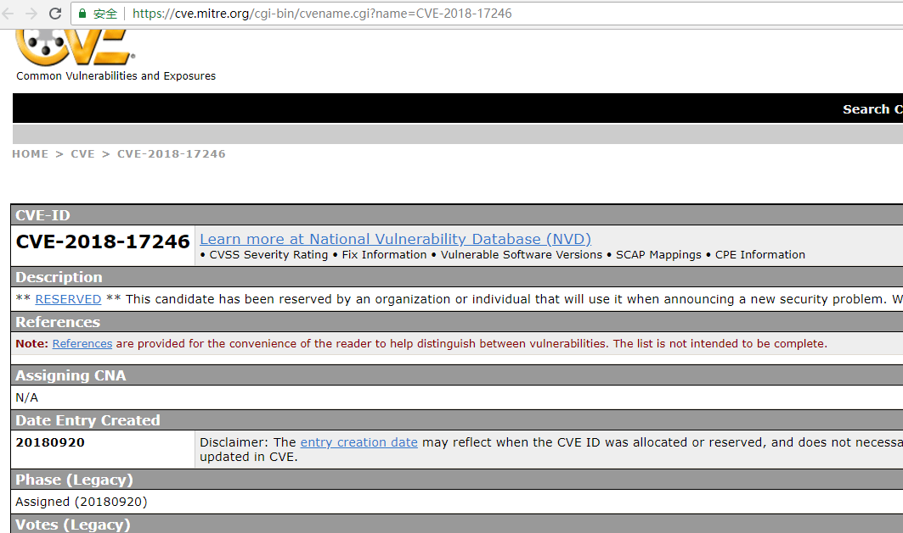
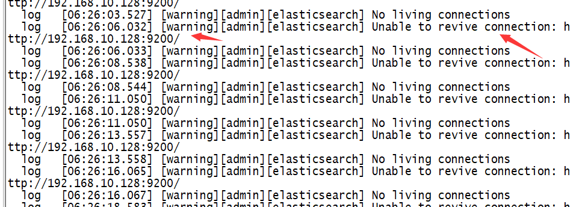
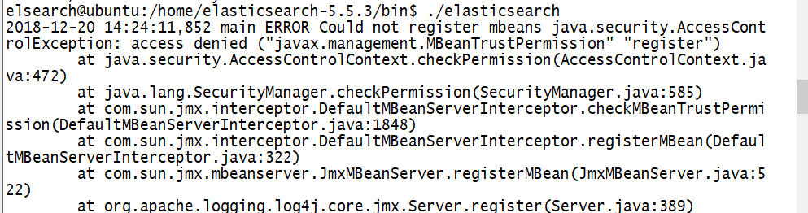
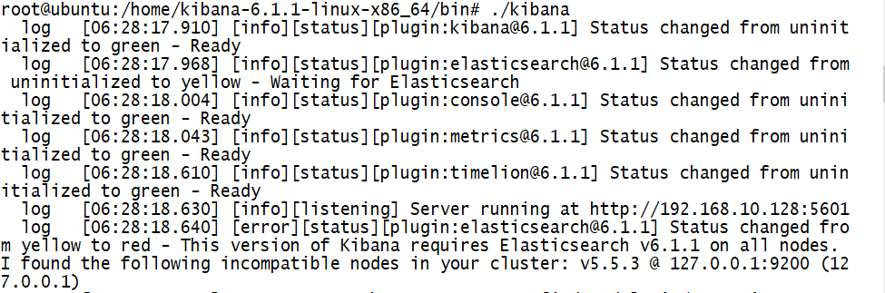
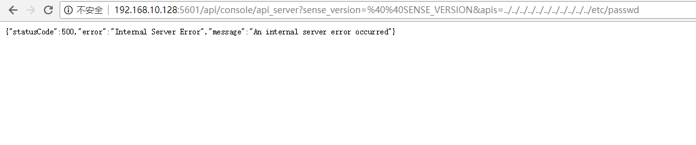
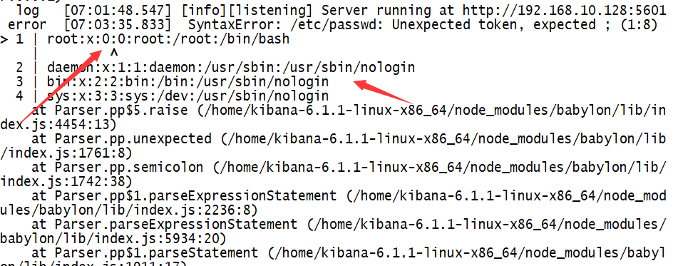
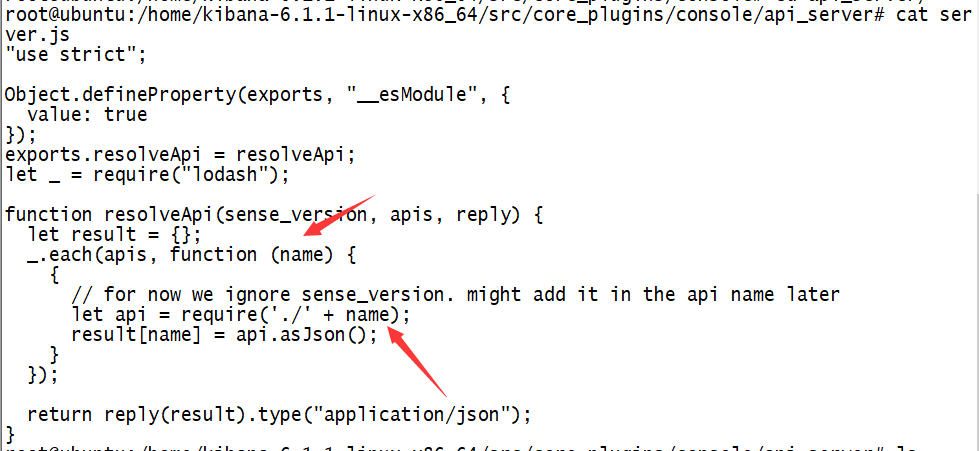
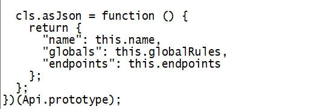
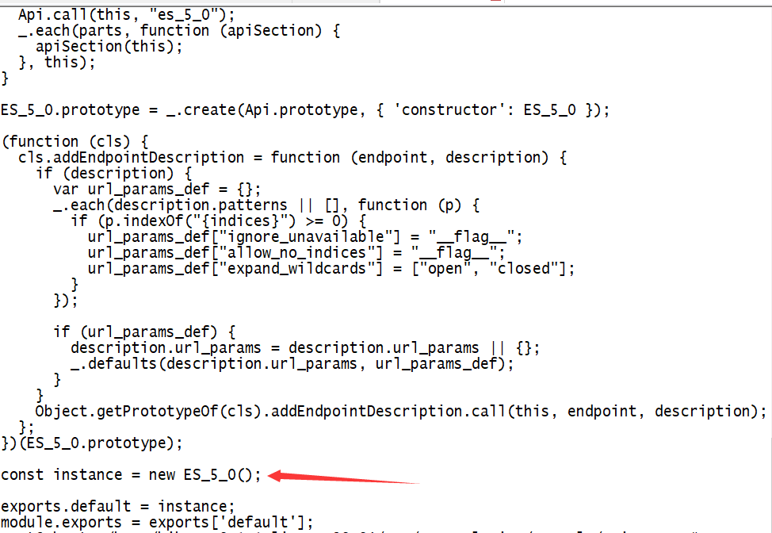
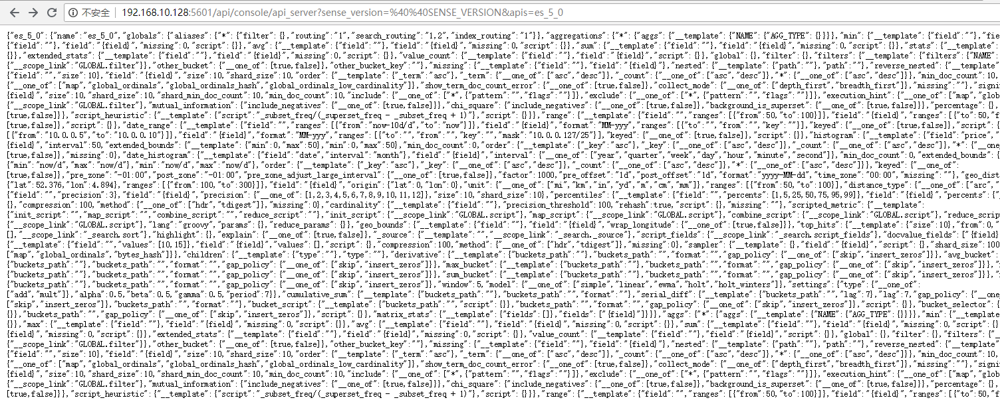

# Elasticsearch-Kibana 漏洞复现及分析（CVE-2018-17246）

## 概述

    CyberArk实验室发现的Kibana中一个严重的严重本地文件包含（LFI）漏洞。根据OWASP基金会的说法，“LFI是通过利用应用程序中实施的易受攻击的包含程序来包含已经存在于服务器上的文件的过程。”通常，这种攻击方法用于敏感信息泄露，但是在某些情况下，正如您将在此处阅读的那样，它使攻击者能够执行服务器上存在的代码。
    在发现此漏洞后，CyberArk Labs在负责的披露流程后于2018年10月向Elastic发出警告。分配给CVE-2018-17246的漏洞随后由Elastic修复。

## 漏洞复现

搭环境遇到了很多问题，记录一下

首先我直接下载，并安装了`kibana-6.1.1-linux-x86_64`。错误提醒连接不上`Elasticsearch`

于是下载了`elasticsearch-5.5.3`，运行前需要确保有`jdk8`。然后运行发生错误，提示说容量不够。

默认要2g,我改成了512m。

提示说不能使用`root`用户运行，需要换个用户。并且`elasticsearch`目录要有权限。

用户错误提示：

目录权限错误提示：

改了用户和权限后运行，终于成功了。

把`kibana`重新运行下，成功。

访问http://ip:5601/

然后访问`http://ip:5601/api/console/api_server?sense_version=%40%40SENSE_VERSION&apis=../../../../../../../../../../../etc/passwd`

在服务器端触发了漏洞。

**网上说的`getshell`是有条件的，必须有上传点，能上传或者写入Javascript文件的话，攻击者才能可通过`Nodejs`创建一个`Reverse Shell` ，然后遍历这个shell，就可以在日志中加载反向shell。**

## 漏洞分析

漏洞文件:`\src\core_plugins\console\api_server\server.js`

将要求的JavaScript文件的名称并调用`asJson`函数。看到没有对名为name的变量的内容进行验证过滤，因此，用户可以输入任何内容。

看下`asJson`函数，在文件`api.js`

在es_5_0.js中有一个这个类的导出实例：

此函数的正常流程是获取导出API类实例并调用函数asJson的JavaScript文件的名称，但是忽略了过滤验证因此我们可以指定任意文件，配合目录跳转遍历就可以实现Kibana服务器上任意文件读取的操作。

## 修复方案

1. 升级最新版本（推荐）
2. 对server.js中的name进行过滤，如`/`，`..`，`../`

## 参考文献

1. https://wh0ale.github.io/2018/12/18/ELK-LFI-CVE-2018-17246/
2. https://mp.weixin.qq.com/s?__biz=MzUyOTc3NTQ5MA==&mid=2247484097&idx=1&sn=1e33f6ca4c86f74aba143cbad44ec4fa&chksm=fa5aac2ccd2d253abae54dd302c124f5bdb2cc816ac3ad2d4ee8685f05990e9e7cc03e829993&mpshare=1&scene=1&srcid=1220045QCclTPsSGUhtWGrGw#rd
3. http://cve.mitre.org/cgi-bin/cvename.cgi?name=CVE-2018-17246
4. https://www.elastic.co/downloads/kibana
