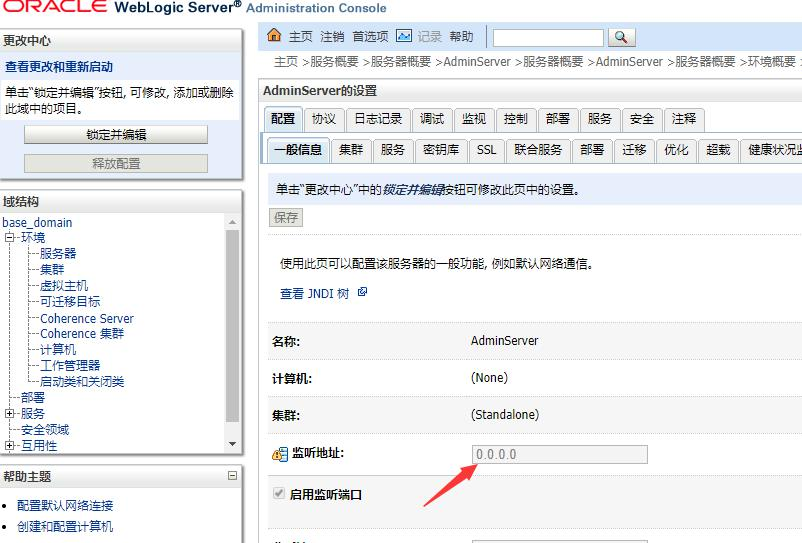
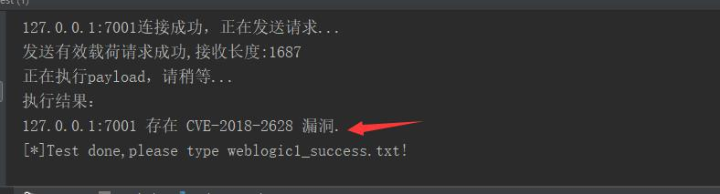
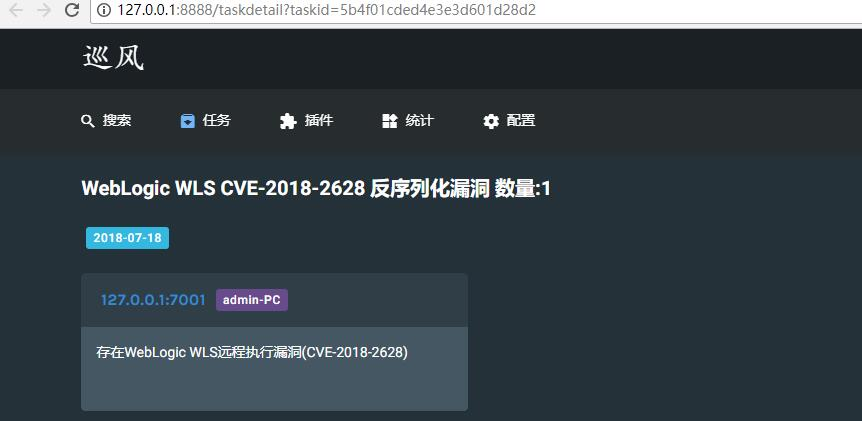

# weblogic反序列化漏洞CVE-2018-2628

## 0x01 搭建漏洞环境

*影响版本*
Oracle WebLogic Server10.3.6.0
Oracle WebLogic Server12.2.1.2
Oracle WebLogic Server12.2.1.3
Oracle WebLogic Server12.1.3.0

以Oracle WebLogic Server10.3.6.0来搭建环境
在官网下载:
`http://download.oracle.com/otn/nt/middleware/11g/wls/1036/oepe-wls-indigo-installer-11.1.1.8.0.201110211138-10.3.6-win32.exe`

安装好了之后将监听地址设置0.0.0.0

## 0x02 漏洞复现

将[POC脚本][1]运行下

复现成功

[巡风][2]已经有了该漏洞的脚本了，可以直接扫

[1]: https://github.com/zhengjim/loophole/tree/master/S2-057
[2]: https://github.com/ysrc/xunfeng