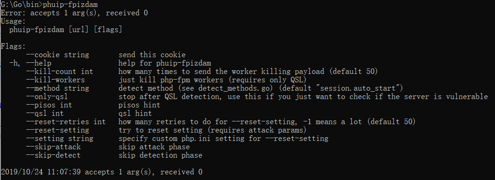
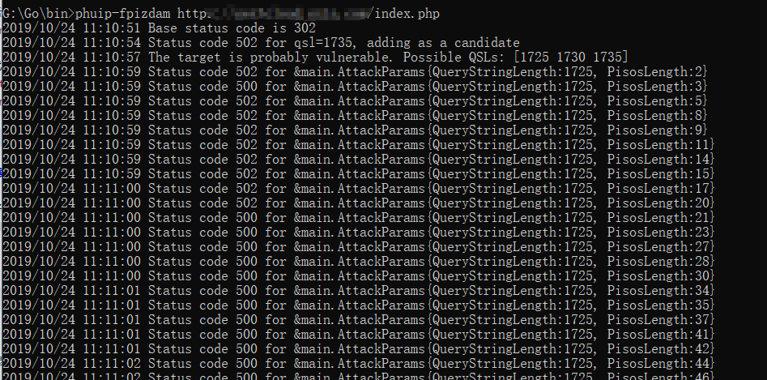
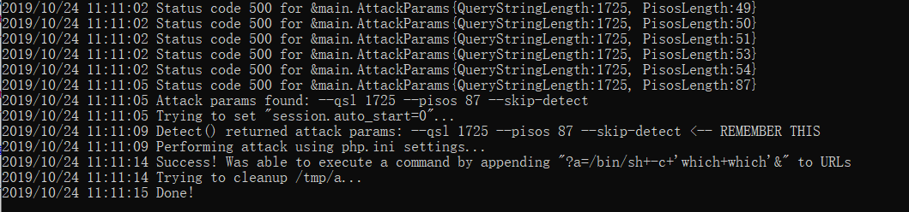
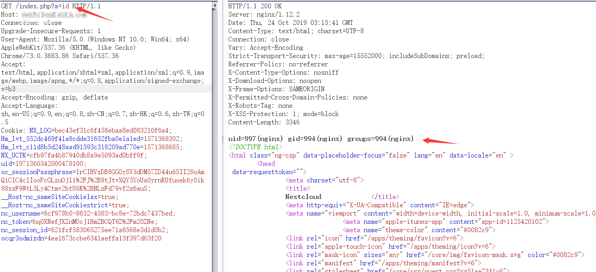
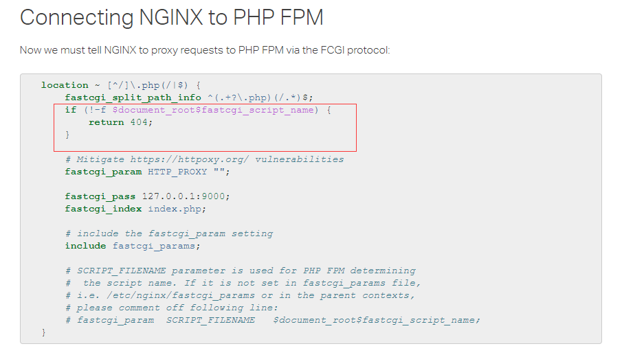

# PHP-FPM 远程代码执行漏洞（CVE-2019-11043）

## 0x01 搭建漏洞环境

> 在长亭科技举办的 Real World CTF 中，国外安全研究员 Andrew Danau 在解决一道 CTF 题目时发现，向目标服务器 URL 发送 %0a 符号时，服务返回异常，疑似存在漏洞。
在使用一些有错误的Nginx配置的情况下，通过恶意构造的数据包，即可让PHP-FPM执行任意代码。

## 0x02 漏洞复现

### 环境
- centos
- php 7.2.22
- PHP-FPM

### 复现过程

攻击机先安装好go环境。这里用window 10。
运行
`go get github.com/neex/phuip-fpizdam`
完成后运行
`go install github.com/neex/phuip-fpizdam`

然后就可以使用了。直接输入`phuip-fpizdam`看是否安装完毕

攻击

成功，去访问index.php?a=id（可能要多刷新几次）

## 修复意见

最好的是升级php版本。

或者可以设置Nginx。

## 参考

- https://github.com/vulhub/vulhub/blob/master/php/CVE-2019-11043/README.zh-cn.md
- https://github.com/neex/phuip-fpizdam
- https://www.nginx.com/resources/wiki/start/topics/examples/phpfcgi/
- https://bugs.php.net/patch-display.php?bug_id=78599&patch=0001-Fix-bug-78599-env_path_info-underflow-can-lead-to-RC.patch&revision=latest