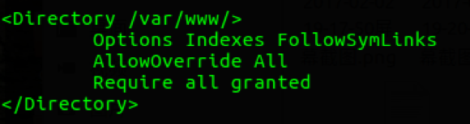
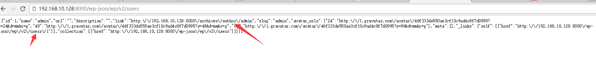

# 漏洞简述

## 1. 漏洞简介
在REST API自动包含在Wordpress4.7以上的版本，WordPress REST API提供了一组易于使用的HTTP端点，可以使用户以简单的JSON格式访问网站的数据，包括用户，帖子，分类等。

检索或更新数据与发送HTTP请求一样简单。

2017年2月，一个由REST API引起的影响WorePress4.7.0和4.7.1版本的漏洞被披露，该漏洞可以导致WordPress所有文章内容可以未经验证被查看，修改，删除，甚至创建新的文章，危害巨大。

## 2.漏洞影响版本

WordPress4.7.0

WordPress4.7.1

# 漏洞复现

1.安装WordPress并配置REST API
配置Apache+PHP+Mysql的运行环境，下载含有漏洞版本的WordPress(https://wordpress.org/wordpress-4.7.1.tar.gz)并安装。

加载Apache的rewrite模块。

在Apache的配置文件中添加
`LoadModule rewrite_module /usr/lib/apache2/modules/mod_rewrite.so `
并在主配置文件中设置对应的WEB目录的AllowOverride为All

设置WordPress站点为固定链接
在Settings->Permalinks中的Common Settings设置为非Plain模式。

发送`http://yourip/wp-json/wp/v2/users`
所有文章内容可以未经验证被查看。

## 修补方案

将WordPress更新到最新版本。

## 参考链接

- https://www.seebug.org/vuldb/ssvid-92637

- https://www.exploit-db.com/exploits/41223/

- https://blog.sucuri.net/2017/02/content-injection-vulnerability-wordpress-rest-api.html
