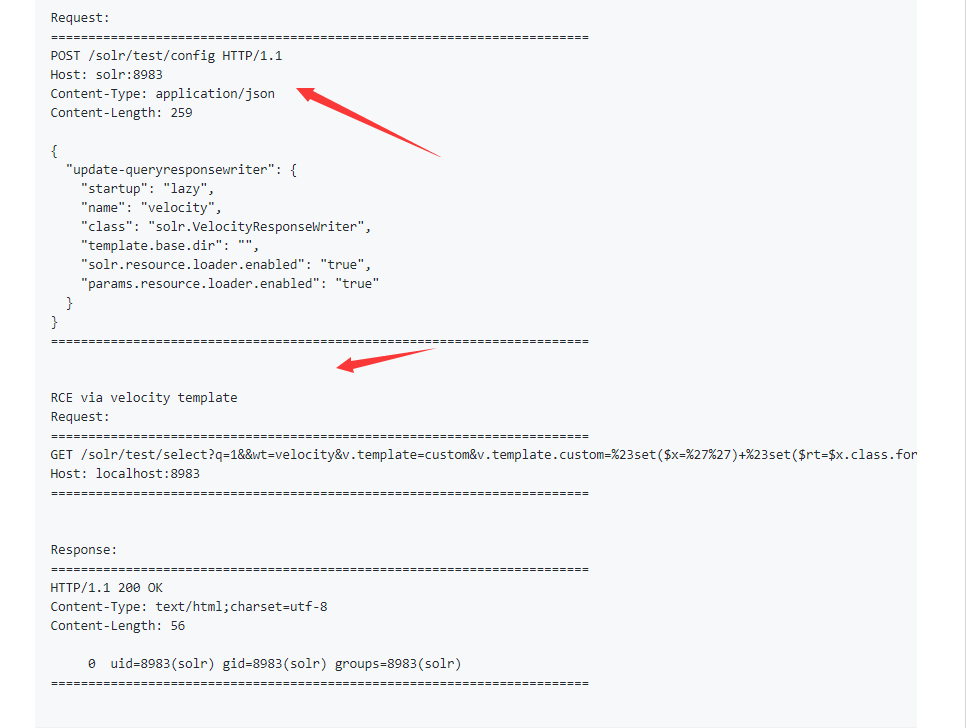
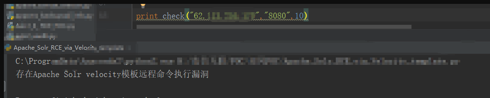

# Apache Solr基于Velocity模板的远程命令执行漏洞

## 0x01 搭建漏洞环境

> 2019年10月末，白帽汇安全研究院发现网络上出现针对Apache Solr服务器的远程代码执行漏洞。该漏洞是由于Velocity模板存在注入所致（Velocity是一个基于Java的模板引擎，可让使用者通过模板语言引用Java中定义的对象）。攻击者在知道Solr服务器上Core名称后，先把params.resource.loader.enabled设置为true（就可加载指定资源），再进行远程执行命令。

## 0x02 漏洞复现

### 环境

fofa上找到一个攻击站点。
http://62.xxx.xxx.170:8080 (国外测试站点)

### 复现过程

根据https://gist.githubusercontent.com/s00py/a1ba36a3689fa13759ff910e179fc133/raw/fae5e663ffac0e3996fd9dbb89438310719d347a/gistfile1.txt
泄露的poc来看，攻击者需要先获取Solr服务中的Core名称才能执行攻击，例如某个存在权限管控不严的Solr的服务器。我们可以从Logging或Core admin栏目得知Core名称。

然后通过POST请求把params.resource.loader.enabled设置为True，此时用户就可以加载指定资源，也就是构造一个能执行命令的恶意请求。（上图的第一个包）

最后进行攻击，可直接从回显中看到命令执行结果。(上图的第二个包)

攻击截图。

## 修复意见

目前，官方尚未发布相关漏洞的安全补丁，请及时关注官方更新，网址：http://lucene.apache.org/solr/downloads.html

临时修复：
1、关闭Solr对外开放
2、如需对外开放，务必设置管理员强口令

## 参考

- https://nosec.org/home/detail/3113.html
- https://mp.weixin.qq.com/s/lcPMwHzawC86DQlJL5743w
- https://mp.weixin.qq.com/s/CEBeXXrQHu15wjizBygTNw
- https://gist.githubusercontent.com/s00py/a1ba36a3689fa13759ff910e179fc133/raw/fae5e663ffac0e3996fd9dbb89438310719d347a/gistfile1.txt